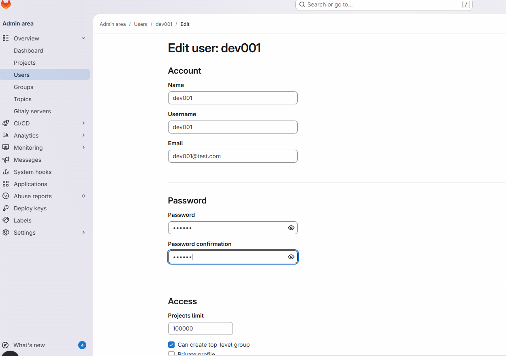

# 07장 - GitLab CE 온프레미스 구축 (Dockerfile 기반)

## GitLab CE 소개
GitLab CE는 소스코드 관리(Git), 이슈 관리, CI/CD 파이프라인을 한 번에 제공하는 DevOps 통합 플랫폼입니다.
온프레미스 환경에서 코드 저장소와 파이프라인을 내부망에서 독립적으로 운영할 때 많이 사용됩니다.

## 이 장의 목표
- Dockerfile 기반 GitLab CE 커스텀 이미지 준비
- 컨테이너 단일 노드로 GitLab 서비스 기동
- 데이터/로그/설정 디렉터리 영속화

## Dockerfile
```dockerfile
FROM gitlab/gitlab-ce:17.5.2-ce.0

ENV GITLAB_OMNIBUS_CONFIG="external_url 'http://gitlab.local'; gitlab_rails['gitlab_shell_ssh_port'] = 2222;"

EXPOSE 80 443 22
```

### 구성 포인트
- `gitlab/gitlab-ce` 공식 이미지 사용
- `GITLAB_OMNIBUS_CONFIG`로 초기 환경값 주입
- HTTP/HTTPS/SSH 포트 노출

## 빌드 및 실행
```bash
# 1) 이미지 빌드
docker build -t onprem-gitlab:1.0 .

# 2) 볼륨 생성
docker volume create gitlab_config
docker volume create gitlab_logs
docker volume create gitlab_data

# 3) 컨테이너 실행
docker run -d --name gitlab-ce \
  --hostname gitlab.local \
  -p 8081:80 -p 8443:443 -p 2222:22 \
  -v gitlab_config:/etc/gitlab \
  -v gitlab_logs:/var/log/gitlab \
  -v gitlab_data:/var/opt/gitlab \
  --shm-size 256m \
  onprem-gitlab:1.0
```

## 초기 루트 비밀번호 확인
```bash
docker exec -it gitlab-ce grep 'Password:' /etc/gitlab/initial_root_password
```

## 운영 팁
- 메모리 최소 4GB 이상 권장
- 사내 DNS 또는 `/etc/hosts`에 `gitlab.local` 등록
- GitLab Runner는 별도 컨테이너로 분리 운영 권장

---



Jh9898aa!!

## 수업 보강 가이드
<!-- course-boost-onprem-v1 -->

### 수업 핵심 관점
- 단일 도구 설치가 목표가 아니라, "소스 -> CI -> 품질 -> 아티팩트 -> 배포" 체인을 완성하는 것이 목표입니다.
- 각 도구는 독립 서비스이면서도 네트워크/계정/권한/스토리지 정책으로 강하게 연결됩니다.

### 실습 운영 체크리스트
- 컨테이너 상태: `docker ps --format 'table {{.Names}}\t{{.Status}}\t{{.Ports}}'`
- 볼륨 상태: `docker volume ls`
- 로그 확인: `docker logs <container> --tail 200`
- 리소스 점검: `docker stats --no-stream`

### 운영 안정화 과제(권장)
1. 컨테이너 재시작 후 데이터 유지 여부 검증
2. 관리자 계정/초기 비밀번호 변경 절차 문서화
3. 백업/복구 테스트(최소 1회)
4. 서비스 헬스체크/장애 알림 조건 정의

### 품질 평가 기준
- 단순 기동이 아니라 "실패 복구"까지 확인했는가
- 파이프라인 실행 기록과 품질 게이트 결과를 남겼는가
- 사내 도입을 가정한 최소 보안 설정(비밀번호/토큰/권한)을 반영했는가

### 다음 단계
- `11-Integrated-DevSecOps-Lab`로 확장하여 인증/시크릿/관측성을 포함한 운영형 실습으로 연결
