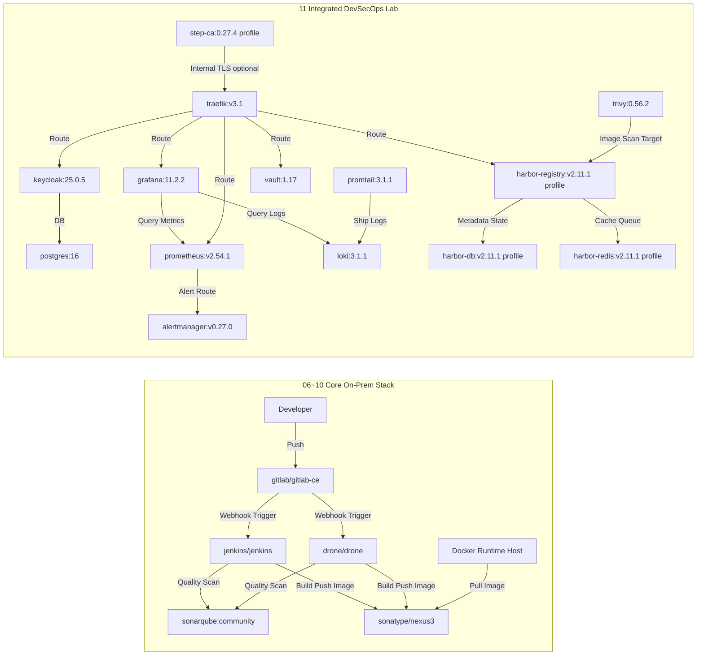

# 🐳 Docker Class Master — Hands-On Lab Guide (English)

> 🇺🇸 English · 🇰🇷 [한국어](./README.ko.md) · 🇯🇵 [日本語](./README.ja.md) · 🇨🇳 [中文](./README.zh.md)

---

## Table of Contents
- [1. Learning Roadmap](#1-learning-roadmap)
- [2. Docker Desktop Quick Controls](#2-docker-desktop-quick-controls)
- [3. Architecture Overview](#3-architecture-overview)
- [4. On-Prem Minimum Resource Sizing](#4-on-prem-minimum-resource-sizing)
- [5. Advanced Operations Stack](#5-advanced-operations-stack)
- [6. Integrated Dependency Diagram](#6-integrated-dependency-diagram)
- [7. WSL Port 80 Troubleshooting](#7-wsl-port-80-troubleshooting)
- [8. Docker Image List](#8-docker-image-list)
- [9. Target Audience and Adoption Roadmap](#9-target-audience-and-adoption-roadmap)
- [10. Extended Curriculum Map (12~25)](#10-extended-curriculum-map-1225)
- [11. Shared Resource Folders](#11-shared-resource-folders)

---

## 🔬 Lab Introduction

This repository is designed to learn Docker from the basics all the way to building a full on-premises DevSecOps platform through **Hands-On Labs**.

| Item | Details |
|---|---|
| Lab Environment | Docker Desktop (Windows/Mac) or Linux Docker Engine |
| Prerequisites | Docker installed, internet connection, minimum 8 GB RAM |
| Lab Style | Step-by-step folder progression, direct CLI execution, result verification |
| Final Goal | Build a complete on-premises CI/CD + security + observability pipeline |

---

## 1. Learning Roadmap

| Step | Topic | Navigate |
|---|---|---|
| 01 | Docker Introduction | [01-Docker-Introduction](./01-Docker-Introduction/README.md) |
| 02 | Docker Installation | [02-Docker-Installation](./02-Docker-Installation/README.md) |
| 03 | Pull & Run Docker Hub Images | [03-Pull-from-DockerHub-and-Run-Docker-Images](./03-Pull-from-DockerHub-and-Run-Docker-Images/README.md) |
| 04 | Build, Run & Push Images | [04-Build-new-Docker-Image-and-Run-and-Push-to-DockerHub](./04-Build-new-Docker-Image-and-Run-and-Push-to-DockerHub/README.md) |
| 05 | Essential Docker Commands | [05-Essential-Docker-Commands](./05-Essential-Docker-Commands/README.md) |
| 06 | Jenkins On-Premises | [06-Jenkins-Server-On-Prem](./06-Jenkins-Server-On-Prem/README.md) |
| 07 | GitLab CE On-Premises | [07-GitLab-CE-On-Prem](./07-GitLab-CE-On-Prem/README.md) |
| 08 | SonarQube On-Premises | [08-SonarQube-On-Prem](./08-SonarQube-On-Prem/README.md) |
| 09 | Nexus Repository On-Premises | [09-Nexus-Repository-On-Prem](./09-Nexus-Repository-On-Prem/README.md) |
| 10 | Drone CI On-Premises | [10-Drone-CI-On-Prem](./10-Drone-CI-On-Prem/README.md) |
| 11 | Integrated DevSecOps Lab | [11-Integrated-DevSecOps-Lab](./11-Integrated-DevSecOps-Lab/README.md) |
| 12 | Advanced Day01: Container Basics | [12-Advanced-Day01-Container-Basics](./12-Advanced-Day01-Container-Basics/README.md) |
| 13 | Advanced Day02: Container Deep Dive | [13-Advanced-Day02-Container-DeepDive](./13-Advanced-Day02-Container-DeepDive/README.md) |
| 14 | Advanced Day03: Image Build | [14-Advanced-Day03-Image-Build](./14-Advanced-Day03-Image-Build/README.md) |
| 15 | Advanced Day04: Image Optimization | [15-Advanced-Day04-Image-Optimization](./15-Advanced-Day04-Image-Optimization/README.md) |
| 16 | Advanced Day05: Networking | [16-Advanced-Day05-Networking](./16-Advanced-Day05-Networking/README.md) |
| 17 | Advanced Day06: Storage & Backup | [17-Advanced-Day06-Storage-Backup](./17-Advanced-Day06-Storage-Backup/README.md) |
| 18 | Advanced Day07: Compose in Practice | [18-Advanced-Day07-Compose-Practice](./18-Advanced-Day07-Compose-Practice/README.md) |
| 19 | Advanced Day08: Debugging & Operations | [19-Advanced-Day08-Debugging-Operations](./19-Advanced-Day08-Debugging-Operations/README.md) |
| 20 | Advanced Day09: Jenkins CI | [20-Advanced-Day09-Jenkins-CI](./20-Advanced-Day09-Jenkins-CI/README.md) |
| 21 | OnPrem Solution: Odoo | [21-OnPrem-Solution-Odoo](./21-OnPrem-Solution-Odoo/README.md) |
| 22 | OnPrem Solution: ERPNext | [22-OnPrem-Solution-ERPNext](./22-OnPrem-Solution-ERPNext/README.md) |
| 23 | OnPrem Solution: Tryton | [23-OnPrem-Solution-Tryton](./23-OnPrem-Solution-Tryton/README.md) |
| 24 | OnPrem Solution: Taiga | [24-OnPrem-Solution-Taiga](./24-OnPrem-Solution-Taiga/README.md) |
| 25 | OnPrem Solution: Zulip | [25-OnPrem-Solution-Zulip](./25-OnPrem-Solution-Zulip/README.md) |

---

## 2. Docker Desktop Quick Controls

### CLI
```bash
# Check status (4.37+)
docker desktop status

# Start / Restart / Stop
docker desktop start
docker desktop restart
docker desktop stop

# View logs
docker desktop logs
```

### PowerShell
```powershell
# Kill all Docker-related processes
Get-Process "*docker*" -ErrorAction SilentlyContinue | Stop-Process -Force

# Relaunch Docker Desktop UI
Start-Process "C:\Program Files\Docker\Docker\Docker Desktop.exe"
```

---

## 3. Architecture Overview

### Core Platform Layers
| Layer | Component |
|---|---|
| Container Runtime | Docker Engine |
| SCM | GitLab CE |
| CI | Jenkins, Drone CI |
| Quality Gate | SonarQube |
| Artifact Registry | Nexus Repository OSS (or Docker Hub/Harbor) |
| Runtime Workload | Nginx, Spring Boot, etc. |

### Reference Flow
1. Developer pushes code to GitLab CE
2. Jenkins or Drone CI pipeline is triggered
3. SonarQube quality gate runs
4. Docker image is built and pushed to Nexus (or Docker Hub)
5. Runtime node pulls the image and deploys

> [!TIP]
> The core chain is: `GitLab -> Jenkins/Drone -> SonarQube -> Nexus -> Docker Runtime`

### Recommended Network Zones
- `Zone 1 (Dev)`: Developer PC, local Docker
- `Zone 2 (CI)`: GitLab, Jenkins/Drone, SonarQube
- `Zone 3 (Artifact)`: Nexus/Harbor
- `Zone 4 (Runtime)`: Service container execution nodes
- `Zone 5 (Ops)`: Monitoring, logging, backup, security

Recommended policies:
- CI Zone → Artifact Zone: Push allowed
- Runtime Zone → Artifact Zone: Pull allowed
- Dev Zone → Runtime Zone: Direct access restricted

---

## 4. On-Prem Minimum Resource Sizing

> [!IMPORTANT]
> The figures below are minimum baselines for single-node lab/PoC use. Production environments should have at least 1.5–2× headroom.

### Scope
- Chapters 06–10: Jenkins, GitLab CE, SonarQube, Nexus, Drone
- Chapter 11: Integrated DevSecOps Lab (`docker-compose.yml`) base/optional profiles
- Reference files:
  - `06-Jenkins-Server-On-Prem/Dockerfile`
  - `07-GitLab-CE-On-Prem/Dockerfile`
  - `08-SonarQube-On-Prem/Dockerfile`
  - `09-Nexus-Repository-On-Prem/Dockerfile`
  - `10-Drone-CI-On-Prem/Dockerfile`
  - `11-Integrated-DevSecOps-Lab/docker-compose.yml`

### Per-Image Minimum Compute Resources
| Role | Docker Image | Min vCPU | Min RAM | Min Disk (Volume) | Notes |
|---|---|---:|---:|---:|---|
| CI | `jenkins/jenkins:lts-jdk17` | 2 | 4 GB | 50 GB | Allow for plugin/workspace growth |
| SCM | `gitlab/gitlab-ce:17.5.2-ce.0` | 4 | 8 GB | 100 GB | Reflects practical minimum headroom |
| Code Quality | `sonarqube:community` | 2 | 4 GB | 50 GB | Use external PostgreSQL in production |
| Artifact | `sonatype/nexus3:3.70.1` | 2 | 4 GB | 100 GB | Watch blob store growth |
| CI (lightweight) | `drone/drone:2` | 1 | 1 GB | 20 GB | Size runners separately |
| Reverse Proxy | `traefik:v3.1` | 1 | 1 GB | 10 GB | Includes cert/access log storage |
| DB | `postgres:16` | 1 | 2 GB | 20 GB | Backend DB for Keycloak |
| IAM | `quay.io/keycloak/keycloak:25.0.5` | 1 | 2 GB | 10 GB | Scale out as users grow |
| Secrets | `hashicorp/vault:1.17` | 1 | 1 GB | 10 GB | Lab uses Dev mode |
| Scanner | `aquasec/trivy:0.56.2` | 1 | 1 GB | 10 GB | Spike load during scans |
| Metrics | `prom/prometheus:v2.54.1` | 2 | 2 GB | 30 GB | Disk grows with retention period |
| Alert | `prom/alertmanager:v0.27.0` | 1 | 1 GB | 5 GB | Alert routing |
| Dashboard | `grafana/grafana:11.2.2` | 1 | 1 GB | 10 GB | Dashboard/plugin storage |
| Logs | `grafana/loki:3.1.1` | 2 | 2 GB | 30 GB | Log retention policy is critical |
| Log Agent | `grafana/promtail:3.1.1` | 1 | 1 GB | 5 GB | Host log collection |
| Private CA (opt) | `smallstep/step-ca:0.27.4` | 1 | 1 GB | 5 GB | `private-ca` profile |
| Harbor DB (opt) | `goharbor/harbor-db:v2.11.1` | 1 | 2 GB | 20 GB | `harbor` profile |
| Harbor Redis (opt) | `goharbor/redis-photon:v2.11.1` | 1 | 1 GB | 10 GB | `harbor` profile |
| Harbor Registry (opt) | `goharbor/registry-photon:v2.11.1` | 2 | 2 GB | 80 GB | `harbor` profile |

### Total Minimum Specs (Single Node)
| Scenario | Min vCPU Total | Min RAM Total | Min Disk Total |
|---|---:|---:|---:|
| Chapters 06–10 core stack (Jenkins+GitLab+Sonar+Nexus+Drone) | 11 | 21 GB | 320 GB |
| Chapter 11 base profile (Traefik–Promtail) | 12 | 14 GB | 140 GB |
| Chapter 11 + `private-ca` + `harbor` profiles | 17 | 20 GB | 255 GB |

Additional recommended overhead: `2 vCPU`, `4 GB RAM`, `30 GB` (host OS + Docker)

---

## 5. Advanced Operations Stack

### Security & Access Control
- Keycloak: SSO and centralized authentication
- HashiCorp Vault: Centralized secrets management
- Trivy: Automated image vulnerability scanning

### Observability
- Prometheus + Grafana: Metrics & dashboards
- Loki + Promtail (or EFK/ELK): Log collection and analysis
- Alertmanager: Alert automation

### Networking & Traffic
- Traefik / Nginx Proxy Manager: Reverse proxy, TLS termination
- Internal PKI strategy based on private CA

### Image Governance
- Harbor: Internal registry + vulnerability scanning + policies
- Can run alongside or replace Nexus

### Backup & DR
- Regular volume/DB backups for GitLab, SonarQube, Nexus
- Object storage archival using MinIO or similar

---

## 6. Integrated Dependency Diagram



Sizing assumptions:
- Single Docker Host, minimum lab baseline
- HA, long-term retention, and high-load scenarios are not reflected
- Prioritize disk expansion for GitLab, SonarQube, and Nexus first

---

## 7. WSL Port 80 Troubleshooting

### 1) Identify the process holding port 80
```bash
# Show processes listening on port 80
sudo ss -ltnp 'sport = :80'

# Detailed process/user/FD info
sudo lsof -iTCP:80 -sTCP:LISTEN -n -P
```

### 2) Stop the process
```bash
# Option A: Stop service (e.g., nginx)
sudo systemctl stop nginx 2>/dev/null || sudo service nginx stop

# Option B: Force kill by PID (example)
sudo kill -9 197
```

### 3) Verify the port is free
```bash
sudo ss -ltnp 'sport = :80'
```

> [!WARNING]
> Use `kill -9` only as a last resort. Always prefer graceful service shutdown when possible.

---

## 8. Docker Image List

| Application | Docker Image |
|---|---|
| Nginx | `nginx` |
| Custom Nginx | `stacksimplify/mynginx_image1` |
| Spring Boot HelloWorld | `stacksimplify/dockerintro-springboot-helloworld-rest-api` |
| Jenkins LTS | `jenkins/jenkins:lts-jdk17` |
| GitLab CE | `gitlab/gitlab-ce:17.5.2-ce.0` |
| SonarQube Community | `sonarqube:community` |
| Nexus Repository OSS | `sonatype/nexus3:3.70.1` |
| Drone CI | `drone/drone:2` |

---

## 9. Target Audience and Adoption Roadmap

### Who This Is For
- Engineers new to Docker
- Teams starting to build on-premises DevOps/Platform environments
- Solution Architects who need to quickly understand how tools interconnect

### Phased Adoption
1. **Phase 1 (Foundations / PoC)**
   - Complete steps 1–10
   - Choose one standard CI tool: Jenkins or Drone
2. **Phase 2 (Standardization)**
   - Establish branch strategy, pipeline templates, SonarQube quality gates
   - Organize Nexus repository structure (by team/environment)
3. **Phase 3 (Operational Stability)**
   - Integrate monitoring, logging, and alerting
   - Conduct backup/recovery rehearsal and write incident runbooks
4. **Phase 4 (Security Hardening)**
   - Introduce SSO, centralized secrets management, image scan/sign policies

---

## 10. Extended Curriculum Map (12~25)

Extended lab structure ordered by difficulty:
- `12–20`: Advanced Day01–Day09
- `21–25`: On-premises solution source study (Odoo, ERPNext, Tryton, Taiga, Zulip)

### Advanced Part (12~20)
| No. | Folder | Core Topic |
|---|---|---|
| 12 | `12-Advanced-Day01-Container-Basics` | Docker basics / first run |
| 13 | `13-Advanced-Day02-Container-DeepDive` | Processes / resources / I/O |
| 14 | `14-Advanced-Day03-Image-Build` | Dockerfile / image build |
| 15 | `15-Advanced-Day04-Image-Optimization` | Multi-stage / optimization |
| 16 | `16-Advanced-Day05-Networking` | Bridge / DNS / communication |
| 17 | `17-Advanced-Day06-Storage-Backup` | Volumes / backup / recovery |
| 18 | `18-Advanced-Day07-Compose-Practice` | Compose in practice |
| 19 | `19-Advanced-Day08-Debugging-Operations` | Failure analysis / Runbook |
| 20 | `20-Advanced-Day09-Jenkins-CI` | CI pipelines |

### OnPrem Solutions Part (21~25)
| No. | Folder | Solution |
|---|---|---|
| 21 | `21-OnPrem-Solution-Odoo` | Odoo |
| 22 | `22-OnPrem-Solution-ERPNext` | ERPNext |
| 23 | `23-OnPrem-Solution-Tryton` | Tryton |
| 24 | `24-OnPrem-Solution-Taiga` | Taiga |
| 25 | `25-OnPrem-Solution-Zulip` | Zulip |

---

## 11. Shared Resource Folders

Separate from the curriculum folders (12–25), the shared resources from the merged repository are maintained below:

- `_shared-advanced-core/`
  - Shared templates, documentation, and capstone (`templates`, `docs`, `capstone`)
  - `labs/dayXX` symlinks point to the upper curriculum folders (12–20)
- `_shared-onprem-core/`
  - Integrated orchestration (`docker-compose.yml`, `start.sh`, `stop.sh`, `sync-solutions.sh`)
  - `solutions/*` symlinks point to the upper curriculum folders (21–25)

---

## 🔬 Lab Tips

### Pre-Lab Checklist
```bash
# Verify Docker is running
docker version
docker info

# Check available disk space (20 GB+ recommended)
df -h

# Check for port conflicts
sudo ss -ltnp | grep -E '80|443|8080|8443|9000|9090|3000'
```

### Post-Lab Cleanup
```bash
# Remove stopped containers
docker container prune -f

# Remove unused images
docker image prune -f

# Remove all unused resources (excluding volumes)
docker system prune -f
```

> [!TIP]
> Each lab folder's `README.md` contains detailed objectives, commands, and verification steps for that lab.
