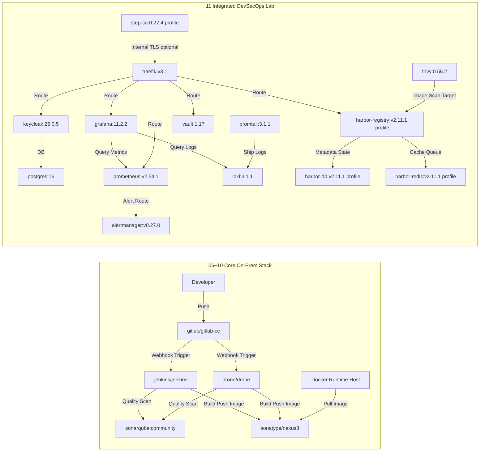

# 🐳 Docker Class Master — ハンズオン・ラボガイド（日本語）

> 🇺🇸 [English](./README.en.md) · 🇰🇷 [한국어](./README.ko.md) · 🇯🇵 日本語 · 🇨🇳 [中文](./README.zh.md)

---

## 目次
- [1. 学習ロードマップ](#1-学習ロードマップ)
- [2. Docker Desktop クイック操作](#2-docker-desktop-クイック操作)
- [3. アーキテクチャ概要](#3-アーキテクチャ概要)
- [4. オンプレミス最小リソース試算](#4-オンプレミス最小リソース試算)
- [5. 運用高度化拡張スタック](#5-運用高度化拡張スタック)
- [6. 統合依存関係ダイアグラム](#6-統合依存関係ダイアグラム)
- [7. WSL ポート80 トラブルシューティング](#7-wsl-ポート80-トラブルシューティング)
- [8. Docker イメージ一覧](#8-docker-イメージ一覧)
- [9. 対象読者と導入ロードマップ](#9-対象読者と導入ロードマップ)
- [10. 拡張カリキュラムマップ（12〜25）](#10-拡張カリキュラムマップ1225)
- [11. 共用リソースフォルダ](#11-共用リソースフォルダ)

---

## 🔬 ラボ紹介

このリポジトリは、Docker の基礎からオンプレミス DevSecOps プラットフォームの構築まで、**ハンズオン・ラボ形式**で学習できるように設計されています。

| 項目 | 内容 |
|---|---|
| ラボ環境 | Docker Desktop (Windows/Mac) または Linux Docker Engine |
| 前提条件 | Docker インストール済み、インターネット接続、最低 8 GB RAM |
| ラボスタイル | ステップバイステップのフォルダ進行、CLI コマンドの直接実行、結果検証 |
| 最終目標 | 完全なオンプレミス CI/CD + セキュリティ + 可観測性パイプラインの構築 |

---

## 1. 学習ロードマップ

| ステップ | トピック | リンク |
|---|---|---|
| 01 | Docker 紹介 | [01-Docker-Introduction](./01-Docker-Introduction/README.md) |
| 02 | Docker インストール | [02-Docker-Installation](./02-Docker-Installation/README.md) |
| 03 | Docker Hub イメージの Pull/Run | [03-Pull-from-DockerHub-and-Run-Docker-Images](./03-Pull-from-DockerHub-and-Run-Docker-Images/README.md) |
| 04 | イメージの Build/Run/Push | [04-Build-new-Docker-Image-and-Run-and-Push-to-DockerHub](./04-Build-new-Docker-Image-and-Run-and-Push-to-DockerHub/README.md) |
| 05 | 必須 Docker コマンド | [05-Essential-Docker-Commands](./05-Essential-Docker-Commands/README.md) |
| 06 | Jenkins オンプレミス構築 | [06-Jenkins-Server-On-Prem](./06-Jenkins-Server-On-Prem/README.md) |
| 07 | GitLab CE オンプレミス構築 | [07-GitLab-CE-On-Prem](./07-GitLab-CE-On-Prem/README.md) |
| 08 | SonarQube オンプレミス構築 | [08-SonarQube-On-Prem](./08-SonarQube-On-Prem/README.md) |
| 09 | Nexus Repository オンプレミス構築 | [09-Nexus-Repository-On-Prem](./09-Nexus-Repository-On-Prem/README.md) |
| 10 | Drone CI オンプレミス構築 | [10-Drone-CI-On-Prem](./10-Drone-CI-On-Prem/README.md) |
| 11 | 統合 DevSecOps ラボ | [11-Integrated-DevSecOps-Lab](./11-Integrated-DevSecOps-Lab/README.md) |
| 12 | Advanced Day01: コンテナ基礎 | [12-Advanced-Day01-Container-Basics](./12-Advanced-Day01-Container-Basics/README.md) |
| 13 | Advanced Day02: コンテナ深掘り | [13-Advanced-Day02-Container-DeepDive](./13-Advanced-Day02-Container-DeepDive/README.md) |
| 14 | Advanced Day03: イメージビルド基礎 | [14-Advanced-Day03-Image-Build](./14-Advanced-Day03-Image-Build/README.md) |
| 15 | Advanced Day04: イメージ最適化 | [15-Advanced-Day04-Image-Optimization](./15-Advanced-Day04-Image-Optimization/README.md) |
| 16 | Advanced Day05: ネットワーキング | [16-Advanced-Day05-Networking](./16-Advanced-Day05-Networking/README.md) |
| 17 | Advanced Day06: ストレージ/バックアップ | [17-Advanced-Day06-Storage-Backup](./17-Advanced-Day06-Storage-Backup/README.md) |
| 18 | Advanced Day07: Compose 実践 | [18-Advanced-Day07-Compose-Practice](./18-Advanced-Day07-Compose-Practice/README.md) |
| 19 | Advanced Day08: デバッグ/運用 | [19-Advanced-Day08-Debugging-Operations](./19-Advanced-Day08-Debugging-Operations/README.md) |
| 20 | Advanced Day09: Jenkins CI | [20-Advanced-Day09-Jenkins-CI](./20-Advanced-Day09-Jenkins-CI/README.md) |
| 21 | OnPrem Solution: Odoo | [21-OnPrem-Solution-Odoo](./21-OnPrem-Solution-Odoo/README.md) |
| 22 | OnPrem Solution: ERPNext | [22-OnPrem-Solution-ERPNext](./22-OnPrem-Solution-ERPNext/README.md) |
| 23 | OnPrem Solution: Tryton | [23-OnPrem-Solution-Tryton](./23-OnPrem-Solution-Tryton/README.md) |
| 24 | OnPrem Solution: Taiga | [24-OnPrem-Solution-Taiga](./24-OnPrem-Solution-Taiga/README.md) |
| 25 | OnPrem Solution: Zulip | [25-OnPrem-Solution-Zulip](./25-OnPrem-Solution-Zulip/README.md) |

---

## 2. Docker Desktop クイック操作

### CLI
```bash
# ステータス確認 (4.37+)
docker desktop status

# 起動 / 再起動 / 停止
docker desktop start
docker desktop restart
docker desktop stop

# ログ確認
docker desktop logs
```

### PowerShell
```powershell
# Docker 関連プロセスをすべて終了
Get-Process "*docker*" -ErrorAction SilentlyContinue | Stop-Process -Force

# Docker Desktop UI を再起動
Start-Process "C:\Program Files\Docker\Docker\Docker Desktop.exe"
```

---

## 3. アーキテクチャ概要

### コアプラットフォームレイヤー
| レイヤー | コンポーネント |
|---|---|
| Container Runtime | Docker Engine |
| SCM | GitLab CE |
| CI | Jenkins、Drone CI |
| Quality Gate | SonarQube |
| Artifact Registry | Nexus Repository OSS（または Docker Hub/Harbor） |
| Runtime Workload | Nginx、Spring Boot など |

### 標準フロー（Reference Flow）
1. 開発者が GitLab CE にコードをプッシュ
2. Jenkins または Drone CI パイプラインが起動
3. SonarQube によるコード品質チェックを実行
4. Docker イメージをビルドして Nexus（または Docker Hub）へプッシュ
5. 本番ノードがイメージをプルしてデプロイ

> [!TIP]
> 基本チェーンは `GitLab -> Jenkins/Drone -> SonarQube -> Nexus -> Docker Runtime` と理解してください。

### 推奨ネットワークゾーン
- `Zone 1 (Dev)`: 開発者 PC、ローカル Docker
- `Zone 2 (CI)`: GitLab、Jenkins/Drone、SonarQube
- `Zone 3 (Artifact)`: Nexus/Harbor
- `Zone 4 (Runtime)`: サービスコンテナ実行ノード
- `Zone 5 (Ops)`: 監視、ロギング、バックアップ、セキュリティ

推奨ポリシー:
- CI Zone → Artifact Zone: プッシュ許可
- Runtime Zone → Artifact Zone: プル許可
- Dev Zone → Runtime Zone: 直接アクセス制限

---

## 4. オンプレミス最小リソース試算

> [!IMPORTANT]
> 以下の数値は、単一ノードでのラボ/PoC を想定した最小基準です。本番環境では最低 1.5〜2 倍のリソース余裕を推奨します。

### 対象範囲
- 第 06〜10 章: Jenkins、GitLab CE、SonarQube、Nexus、Drone
- 第 11 章: Integrated DevSecOps Lab（`docker-compose.yml`）基本/オプションプロファイル

### イメージ別最小コンピューティングリソース
| 役割 | Docker イメージ | 最小 vCPU | 最小 RAM | 最小ディスク | 備考 |
|---|---|---:|---:|---:|---|
| CI | `jenkins/jenkins:lts-jdk17` | 2 | 4 GB | 50 GB | プラグイン/ワークスペース増加を考慮 |
| SCM | `gitlab/gitlab-ce:17.5.2-ce.0` | 4 | 8 GB | 100 GB | 実務最小余裕を反映 |
| Code Quality | `sonarqube:community` | 2 | 4 GB | 50 GB | 本番は外部 PostgreSQL 推奨 |
| Artifact | `sonatype/nexus3:3.70.1` | 2 | 4 GB | 100 GB | Blob ストア増加に注意 |
| CI (軽量) | `drone/drone:2` | 1 | 1 GB | 20 GB | Runner は別途試算 |
| Reverse Proxy | `traefik:v3.1` | 1 | 1 GB | 10 GB | 証明書/アクセスログ含む |
| DB | `postgres:16` | 1 | 2 GB | 20 GB | Keycloak バックエンド DB |
| IAM | `quay.io/keycloak/keycloak:25.0.5` | 1 | 2 GB | 10 GB | ユーザー増加時は拡張 |
| Secrets | `hashicorp/vault:1.17` | 1 | 1 GB | 10 GB | ラボは Dev モード |
| Scanner | `aquasec/trivy:0.56.2` | 1 | 1 GB | 10 GB | スキャン時の一時的負荷増加あり |
| Metrics | `prom/prometheus:v2.54.1` | 2 | 2 GB | 30 GB | 保存期間に比例してディスク増加 |
| Alert | `prom/alertmanager:v0.27.0` | 1 | 1 GB | 5 GB | アラートルーティング |
| Dashboard | `grafana/grafana:11.2.2` | 1 | 1 GB | 10 GB | ダッシュボード/プラグイン保存 |
| Logs | `grafana/loki:3.1.1` | 2 | 2 GB | 30 GB | ログ保存ポリシーが重要 |
| Log Agent | `grafana/promtail:3.1.1` | 1 | 1 GB | 5 GB | ホストログ収集 |
| Private CA (opt) | `smallstep/step-ca:0.27.4` | 1 | 1 GB | 5 GB | `private-ca` プロファイル |
| Harbor DB (opt) | `goharbor/harbor-db:v2.11.1` | 1 | 2 GB | 20 GB | `harbor` プロファイル |
| Harbor Redis (opt) | `goharbor/redis-photon:v2.11.1` | 1 | 1 GB | 10 GB | `harbor` プロファイル |
| Harbor Registry (opt) | `goharbor/registry-photon:v2.11.1` | 2 | 2 GB | 80 GB | `harbor` プロファイル |

### 合計最小スペック（単一ノード）
| シナリオ | 最小 vCPU 合計 | 最小 RAM 合計 | 最小ディスク合計 |
|---|---:|---:|---:|
| 第 06〜10 章コアスタック | 11 | 21 GB | 320 GB |
| 第 11 章基本プロファイル | 12 | 14 GB | 140 GB |
| 第 11 章 + `private-ca` + `harbor` プロファイル | 17 | 20 GB | 255 GB |

追加推奨オーバーヘッド: `2 vCPU`、`4 GB RAM`、`30 GB`（ホスト OS + Docker）

---

## 5. 運用高度化拡張スタック

### セキュリティ/アクセス制御
- Keycloak: SSO と集中認証
- HashiCorp Vault: シークレット集中管理
- Trivy: イメージ脆弱性スキャンの自動化

### 可観測性
- Prometheus + Grafana: メトリクス/ダッシュボード
- Loki + Promtail（または EFK/ELK）: ログ収集/分析
- Alertmanager: アラート自動化

### ネットワーク/トラフィック
- Traefik / Nginx Proxy Manager: リバースプロキシ、TLS 終端
- プライベート CA ベースの証明書運用戦略

### イメージガバナンス
- Harbor: 内部レジストリ + 脆弱性スキャン + ポリシー
- Nexus と並行または代替運用が可能

### バックアップ/DR
- GitLab、SonarQube、Nexus のボリューム/DB 定期バックアップ
- MinIO などのオブジェクトストレージによる保管

---

## 6. 統合依存関係ダイアグラム



試算前提:
- 単一 Docker ホスト、最小ラボ基準
- HA・長期保存・大規模負荷は未反映
- ディスクは GitLab/SonarQube/Nexus から優先的に拡張

---

## 7. WSL ポート 80 トラブルシューティング

### 1) ポート 80 を占有しているプロセスを確認
```bash
# ポート 80 で LISTEN 中のプロセス
sudo ss -ltnp 'sport = :80'

# プロセス/ユーザー/FD の詳細確認
sudo lsof -iTCP:80 -sTCP:LISTEN -n -P
```

### 2) プロセスを停止
```bash
# 方法 A: サービス停止（例: nginx）
sudo systemctl stop nginx 2>/dev/null || sudo service nginx stop

# 方法 B: PID による強制終了（例）
sudo kill -9 197
```

### 3) 解放確認
```bash
sudo ss -ltnp 'sport = :80'
```

> [!WARNING]
> `kill -9` は最終手段としてのみ使用し、可能な限りサービスの正常停止を優先してください。

---

## 8. Docker イメージ一覧

| アプリケーション | Docker イメージ |
|---|---|
| Nginx | `nginx` |
| カスタム Nginx | `stacksimplify/mynginx_image1` |
| Spring Boot HelloWorld | `stacksimplify/dockerintro-springboot-helloworld-rest-api` |
| Jenkins LTS | `jenkins/jenkins:lts-jdk17` |
| GitLab CE | `gitlab/gitlab-ce:17.5.2-ce.0` |
| SonarQube Community | `sonarqube:community` |
| Nexus Repository OSS | `sonatype/nexus3:3.70.1` |
| Drone CI | `drone/drone:2` |

---

## 9. 対象読者と導入ロードマップ

### 対象読者
- Docker を初めて学ぶエンジニア
- オンプレミス DevOps/Platform 構築を始めるチーム
- ツール間の連携構造を素早く把握したい Solution Architect

### 段階的導入
1. **Phase 1（基礎/PoC）**
   - ステップ 1〜10 の実習を完了
   - Jenkins/Drone のどちらかを標準 CI として選定
2. **Phase 2（標準化）**
   - ブランチ戦略、パイプラインテンプレート、SonarQube 品質ゲートの標準化
   - Nexus リポジトリ構造（チーム/環境別）の整理
3. **Phase 3（運用安定化）**
   - 監視/ログ/アラートの連携
   - バックアップ/復旧リハーサルおよびインシデントランブック作成
4. **Phase 4（セキュリティ強化）**
   - SSO、シークレット集中管理、イメージスキャン/署名ポリシーの導入

---

## 10. 拡張カリキュラムマップ（12〜25）

難易度順の拡張ラボ構成:
- `12〜20`: Advanced Day01〜Day09
- `21〜25`: OnPrem ソリューション別ソース学習

### Advanced パート（12〜20）
| No. | フォルダ | 主要テーマ |
|---|---|---|
| 12 | `12-Advanced-Day01-Container-Basics` | Docker 基礎/初回実行 |
| 13 | `13-Advanced-Day02-Container-DeepDive` | プロセス/リソース/IO |
| 14 | `14-Advanced-Day03-Image-Build` | Dockerfile/イメージビルド |
| 15 | `15-Advanced-Day04-Image-Optimization` | マルチステージ/最適化 |
| 16 | `16-Advanced-Day05-Networking` | ブリッジ/DNS/通信 |
| 17 | `17-Advanced-Day06-Storage-Backup` | ボリューム/バックアップ/復旧 |
| 18 | `18-Advanced-Day07-Compose-Practice` | Compose 実践 |
| 19 | `19-Advanced-Day08-Debugging-Operations` | 障害分析/Runbook |
| 20 | `20-Advanced-Day09-Jenkins-CI` | CI パイプライン |

### OnPrem ソリューションパート（21〜25）
| No. | フォルダ | ソリューション |
|---|---|---|
| 21 | `21-OnPrem-Solution-Odoo` | Odoo |
| 22 | `22-OnPrem-Solution-ERPNext` | ERPNext |
| 23 | `23-OnPrem-Solution-Tryton` | Tryton |
| 24 | `24-OnPrem-Solution-Taiga` | Taiga |
| 25 | `25-OnPrem-Solution-Zulip` | Zulip |

---

## 11. 共用リソースフォルダ

カリキュラムフォルダ（12〜25）とは別に、マージされたリポジトリの共用リソースは以下に維持されます:

- `_shared-advanced-core/`
  - 共用テンプレート/ドキュメント/キャップストーン（`templates`、`docs`、`capstone`）
  - `labs/dayXX` は上位カリキュラムフォルダ（12〜20）へのシンボリックリンク
- `_shared-onprem-core/`
  - 統合オーケストレーション（`docker-compose.yml`、`start.sh`、`stop.sh`、`sync-solutions.sh`）
  - `solutions/*` は上位カリキュラムフォルダ（21〜25）へのシンボリックリンク

---

## 🔬 ラボ運用のヒント

### ラボ開始前チェックリスト
```bash
# Docker の動作確認
docker version
docker info

# ディスク空き容量の確認（20 GB 以上推奨）
df -h

# ポート競合の事前確認
sudo ss -ltnp | grep -E '80|443|8080|8443|9000|9090|3000'
```

### ラボ終了後のクリーンアップ
```bash
# 停止済みコンテナを一括削除
docker container prune -f

# 未使用イメージを削除
docker image prune -f

# 未使用リソースをすべて削除（ボリューム除く）
docker system prune -f
```

> [!TIP]
> 各ラボフォルダの `README.md` には、そのラボの目標、コマンド、検証手順が詳細に記載されています。
