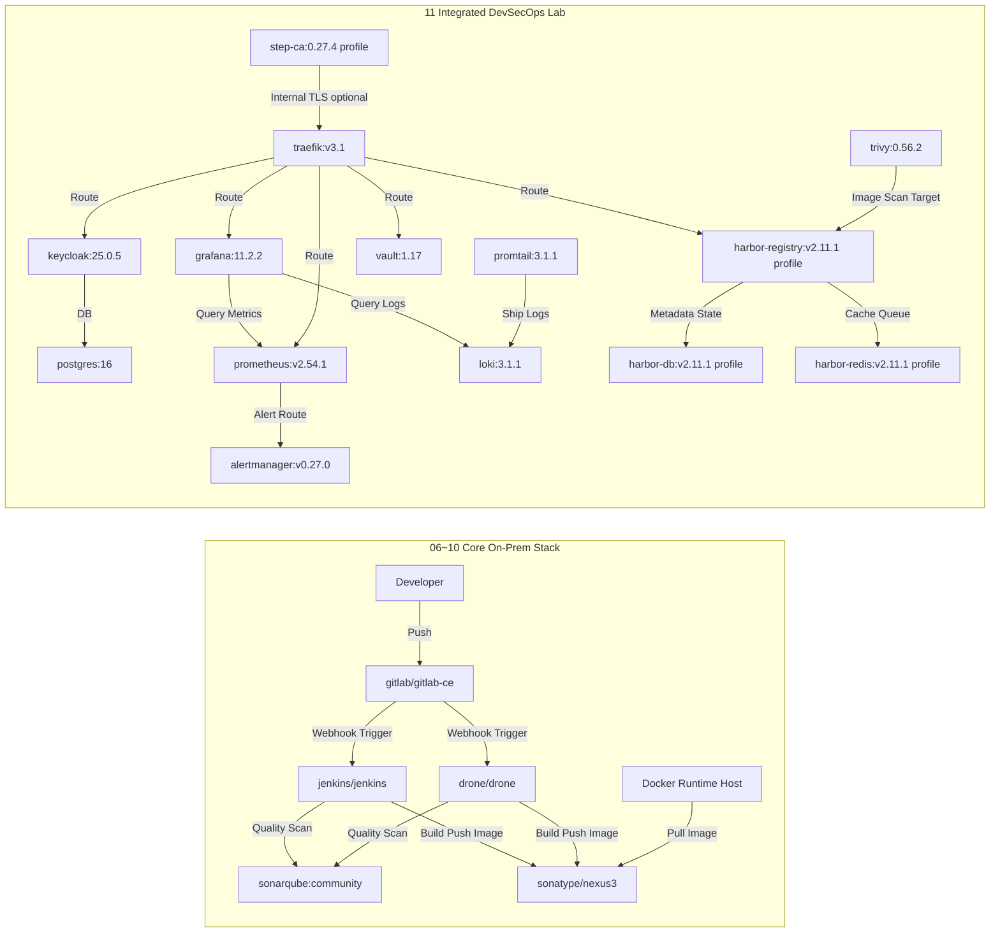

# 🐳 Docker Class Master — 실습 랩 가이드 (한국어)

> 🇺🇸 [English](./README.en.md) · 🇰🇷 한국어 · 🇯🇵 [日本語](./README.ja.md) · 🇨🇳 [中文](./README.zh.md)

---

## 목차
- [1. 학습 로드맵](#1-학습-로드맵)
- [2. Docker Desktop 빠른 제어](#2-docker-desktop-빠른-제어)
- [3. 아키텍처 개요](#3-아키텍처-개요)
- [4. 온프렘 최소 자원 산정](#4-온프렘-최소-자원-산정)
- [5. 운영 고도화 확장 스택](#5-운영-고도화-확장-스택)
- [6. 통합 의존관계 다이어그램](#6-통합-의존관계-다이어그램)
- [7. WSL 포트 80 트러블슈팅](#7-wsl-포트-80-트러블슈팅)
- [8. Docker 이미지 목록](#8-docker-이미지-목록)
- [9. 대상 독자와 도입 로드맵](#9-대상-독자와-도입-로드맵)
- [10. 확장 커리큘럼 맵 (12~25)](#10-확장-커리큘럼-맵-1225)
- [11. 공용 리소스 폴더](#11-공용-리소스-폴더)

---

## 🔬 랩 소개

이 저장소는 Docker의 기초부터 온프레미스 DevSecOps 플랫폼 구축까지를 **핸즈온 실습(Hands-On Lab)** 형태로 학습할 수 있도록 설계되어 있습니다.

| 항목 | 내용 |
|---|---|
| 실습 환경 | Docker Desktop (Windows/Mac) 또는 Linux Docker Engine |
| 사전 요구사항 | Docker 설치 완료, 인터넷 연결, 최소 8 GB RAM |
| 실습 방식 | 단계별 폴더 진행, CLI 명령 직접 실행, 결과 검증 |
| 최종 목표 | 완전한 온프레미스 CI/CD + 보안 + 관측성 파이프라인 구축 |

---

## 1. 학습 로드맵

| 단계 | 주제 | 이동 |
|---|---|---|
| 01 | Docker 소개 | [01-Docker-Introduction](./01-Docker-Introduction/README.md) |
| 02 | Docker 설치 | [02-Docker-Installation](./02-Docker-Installation/README.md) |
| 03 | Docker Hub 이미지 Pull/Run | [03-Pull-from-DockerHub-and-Run-Docker-Images](./03-Pull-from-DockerHub-and-Run-Docker-Images/README.md) |
| 04 | 이미지 Build/Run/Push | [04-Build-new-Docker-Image-and-Run-and-Push-to-DockerHub](./04-Build-new-Docker-Image-and-Run-and-Push-to-DockerHub/README.md) |
| 05 | 핵심 Docker 명령어 | [05-Essential-Docker-Commands](./05-Essential-Docker-Commands/README.md) |
| 06 | Jenkins 온프레미스 구축 | [06-Jenkins-Server-On-Prem](./06-Jenkins-Server-On-Prem/README.md) |
| 07 | GitLab CE 온프레미스 구축 | [07-GitLab-CE-On-Prem](./07-GitLab-CE-On-Prem/README.md) |
| 08 | SonarQube 온프레미스 구축 | [08-SonarQube-On-Prem](./08-SonarQube-On-Prem/README.md) |
| 09 | Nexus Repository 온프레미스 구축 | [09-Nexus-Repository-On-Prem](./09-Nexus-Repository-On-Prem/README.md) |
| 10 | Drone CI 온프레미스 구축 | [10-Drone-CI-On-Prem](./10-Drone-CI-On-Prem/README.md) |
| 11 | 통합 DevSecOps Lab | [11-Integrated-DevSecOps-Lab](./11-Integrated-DevSecOps-Lab/README.md) |
| 12 | Advanced Day01: Docker 개요 & 첫 걸음 | [12-Advanced-Day01-Container-Basics](./12-Advanced-Day01-Container-Basics/README.md) |
| 13 | Advanced Day02: 컨테이너 심화 | [13-Advanced-Day02-Container-DeepDive](./13-Advanced-Day02-Container-DeepDive/README.md) |
| 14 | Advanced Day03: 이미지 빌드 기초 | [14-Advanced-Day03-Image-Build](./14-Advanced-Day03-Image-Build/README.md) |
| 15 | Advanced Day04: 이미지 최적화 | [15-Advanced-Day04-Image-Optimization](./15-Advanced-Day04-Image-Optimization/README.md) |
| 16 | Advanced Day05: 네트워킹 | [16-Advanced-Day05-Networking](./16-Advanced-Day05-Networking/README.md) |
| 17 | Advanced Day06: 스토리지/백업복구 | [17-Advanced-Day06-Storage-Backup](./17-Advanced-Day06-Storage-Backup/README.md) |
| 18 | Advanced Day07: Compose 실전 | [18-Advanced-Day07-Compose-Practice](./18-Advanced-Day07-Compose-Practice/README.md) |
| 19 | Advanced Day08: 디버깅/운영 | [19-Advanced-Day08-Debugging-Operations](./19-Advanced-Day08-Debugging-Operations/README.md) |
| 20 | Advanced Day09: Jenkins CI | [20-Advanced-Day09-Jenkins-CI](./20-Advanced-Day09-Jenkins-CI/README.md) |
| 21 | OnPrem Solution: Odoo | [21-OnPrem-Solution-Odoo](./21-OnPrem-Solution-Odoo/README.md) |
| 22 | OnPrem Solution: ERPNext | [22-OnPrem-Solution-ERPNext](./22-OnPrem-Solution-ERPNext/README.md) |
| 23 | OnPrem Solution: Tryton | [23-OnPrem-Solution-Tryton](./23-OnPrem-Solution-Tryton/README.md) |
| 24 | OnPrem Solution: Taiga | [24-OnPrem-Solution-Taiga](./24-OnPrem-Solution-Taiga/README.md) |
| 25 | OnPrem Solution: Zulip | [25-OnPrem-Solution-Zulip](./25-OnPrem-Solution-Zulip/README.md) |

---

## 2. Docker Desktop 빠른 제어

### CLI
```bash
# 상태 확인 (4.37+)
docker desktop status

# 시작 / 재시작 / 중지
docker desktop start
docker desktop restart
docker desktop stop

# 로그 확인
docker desktop logs
```

### PowerShell
```powershell
# Docker Desktop 관련 프로세스 종료
Get-Process "*docker*" -ErrorAction SilentlyContinue | Stop-Process -Force

# Docker Desktop UI 재실행
Start-Process "C:\Program Files\Docker\Docker\Docker Desktop.exe"
```

---

## 3. 아키텍처 개요

### 핵심 플랫폼 레이어
| 레이어 | 구성 요소 |
|---|---|
| Container Runtime | Docker Engine |
| SCM | GitLab CE |
| CI | Jenkins, Drone CI |
| Quality Gate | SonarQube |
| Artifact Registry | Nexus Repository OSS (또는 Docker Hub/Harbor) |
| Runtime Workload | Nginx, Spring Boot 등 |

### 표준 흐름 (Reference Flow)
1. 개발자가 GitLab CE에 코드 Push
2. Jenkins 또는 Drone CI 파이프라인 실행
3. SonarQube 품질 검사 수행
4. Docker 이미지 빌드 후 Nexus(또는 Docker Hub)로 Push
5. 운영 노드가 이미지 Pull 후 배포

> [!TIP]
> 기본 체인은 `GitLab -> Jenkins/Drone -> SonarQube -> Nexus -> Docker Runtime` 으로 이해하면 됩니다.

### 권장 네트워크 존
- `Zone 1 (Dev)`: 개발자 PC, 로컬 Docker
- `Zone 2 (CI)`: GitLab, Jenkins/Drone, SonarQube
- `Zone 3 (Artifact)`: Nexus/Harbor
- `Zone 4 (Runtime)`: 서비스 컨테이너 실행 노드
- `Zone 5 (Ops)`: 모니터링, 로깅, 백업, 보안

권장 정책:
- CI Zone → Artifact Zone: Push 허용
- Runtime Zone → Artifact Zone: Pull 허용
- Dev Zone → Runtime Zone: 직접 접근 제한

---

## 4. 온프렘 최소 자원 산정

> [!IMPORTANT]
> 아래 수치는 단일 노드 실습/PoC 최소 기준입니다. 운영 환경은 최소 1.5~2배 여유 자원을 권장합니다.

### 기준 범위
- 06~10장: Jenkins, GitLab CE, SonarQube, Nexus, Drone
- 11장: Integrated DevSecOps Lab (`docker-compose.yml`) 기본/선택 프로파일
- 기준 파일:
  - `06-Jenkins-Server-On-Prem/Dockerfile`
  - `07-GitLab-CE-On-Prem/Dockerfile`
  - `08-SonarQube-On-Prem/Dockerfile`
  - `09-Nexus-Repository-On-Prem/Dockerfile`
  - `10-Drone-CI-On-Prem/Dockerfile`
  - `11-Integrated-DevSecOps-Lab/docker-compose.yml`

### 이미지별 최소 컴퓨팅 자원
| 구분 | Docker 이미지 | 최소 vCPU | 최소 RAM | 최소 디스크(볼륨) | 비고 |
|---|---|---:|---:|---:|---|
| CI | `jenkins/jenkins:lts-jdk17` | 2 | 4 GB | 50 GB | 플러그인/워크스페이스 증가 고려 |
| SCM | `gitlab/gitlab-ce:17.5.2-ce.0` | 4 | 8 GB | 100 GB | 실무 최소 여유 반영 |
| Code Quality | `sonarqube:community` | 2 | 4 GB | 50 GB | 운영은 외부 PostgreSQL 연동 권장 |
| Artifact | `sonatype/nexus3:3.70.1` | 2 | 4 GB | 100 GB | Blob 저장 증가 유의 |
| CI (경량) | `drone/drone:2` | 1 | 1 GB | 20 GB | Runner 별도 산정 필요 |
| Reverse Proxy | `traefik:v3.1` | 1 | 1 GB | 10 GB | 인증서/액세스 로그 포함 |
| DB | `postgres:16` | 1 | 2 GB | 20 GB | Keycloak 백엔드 DB |
| IAM | `quay.io/keycloak/keycloak:25.0.5` | 1 | 2 GB | 10 GB | 사용자 증가 시 확장 필요 |
| Secrets | `hashicorp/vault:1.17` | 1 | 1 GB | 10 GB | 레포는 Dev 모드 |
| Scanner | `aquasec/trivy:0.56.2` | 1 | 1 GB | 10 GB | 스캔 시 순간 부하 증가 |
| Metrics | `prom/prometheus:v2.54.1` | 2 | 2 GB | 30 GB | 보관 기간에 비례해 디스크 증가 |
| Alert | `prom/alertmanager:v0.27.0` | 1 | 1 GB | 5 GB | 알림 라우팅 |
| Dashboard | `grafana/grafana:11.2.2` | 1 | 1 GB | 10 GB | 대시보드/플러그인 저장 |
| Logs | `grafana/loki:3.1.1` | 2 | 2 GB | 30 GB | 로그 보관 정책 핵심 |
| Log Agent | `grafana/promtail:3.1.1` | 1 | 1 GB | 5 GB | 호스트 로그 수집 |
| Private CA (옵션) | `smallstep/step-ca:0.27.4` | 1 | 1 GB | 5 GB | `private-ca` profile |
| Harbor DB (옵션) | `goharbor/harbor-db:v2.11.1` | 1 | 2 GB | 20 GB | `harbor` profile |
| Harbor Redis (옵션) | `goharbor/redis-photon:v2.11.1` | 1 | 1 GB | 10 GB | `harbor` profile |
| Harbor Registry (옵션) | `goharbor/registry-photon:v2.11.1` | 2 | 2 GB | 80 GB | `harbor` profile |

### 합산 최소 사양 (단일 노드)
| 시나리오 | 최소 vCPU 합계 | 최소 RAM 합계 | 최소 디스크 합계 |
|---|---:|---:|---:|
| 06~10장 핵심 스택 (Jenkins+GitLab+Sonar+Nexus+Drone) | 11 | 21 GB | 320 GB |
| 11장 기본 프로파일 (Traefik~Promtail) | 12 | 14 GB | 140 GB |
| 11장 + `private-ca` + `harbor` 프로파일 | 17 | 20 GB | 255 GB |

추가 권장 오버헤드: `2 vCPU`, `4 GB RAM`, `30 GB` (호스트 OS + Docker)

---

## 5. 운영 고도화 확장 스택

### 보안/접근제어
- Keycloak: SSO 및 중앙 인증
- HashiCorp Vault: 비밀정보 중앙관리
- Trivy: 이미지 취약점 스캔 자동화

### 관측성
- Prometheus + Grafana: 메트릭/대시보드
- Loki + Promtail (또는 EFK/ELK): 로그 수집/분석
- Alertmanager: 알림 자동화

### 네트워크/트래픽
- Traefik / Nginx Proxy Manager: 리버스 프록시, TLS 종료
- 사설 CA 기반 인증서 운영 전략 수립

### 이미지 거버넌스
- Harbor: 내부 레지스트리 + 취약점 스캔 + 정책
- Nexus와 병행 또는 대체 가능

### 백업/DR
- GitLab, SonarQube, Nexus 볼륨/DB 정기 백업
- MinIO 등 오브젝트 스토리지 기반 보관

---

## 6. 통합 의존관계 다이어그램



산정 가정:
- 단일 Docker Host 최소 실습 기준
- HA/장기보관/대규모 부하는 미반영
- 디스크는 GitLab/SonarQube/Nexus부터 우선 확장 고려

---

## 7. WSL 포트 80 트러블슈팅

### 1) 점유 프로세스 확인
```bash
# LISTEN 중인 80 포트 프로세스
sudo ss -ltnp 'sport = :80'

# 프로세스/사용자/FD 상세 확인
sudo lsof -iTCP:80 -sTCP:LISTEN -n -P
```

### 2) 점유 프로세스 종료
```bash
# 방법 A: 서비스 종료 (예: nginx)
sudo systemctl stop nginx 2>/dev/null || sudo service nginx stop

# 방법 B: PID 강제 종료 (예시)
sudo kill -9 197
```

### 3) 해제 확인
```bash
sudo ss -ltnp 'sport = :80'
```

> [!WARNING]
> `kill -9`는 마지막 수단으로만 사용하고, 가능하면 서비스 정상 종료를 우선 사용하세요.

---

## 8. Docker 이미지 목록

| 애플리케이션 | Docker 이미지 |
|---|---|
| Nginx | `nginx` |
| 커스텀 Nginx | `stacksimplify/mynginx_image1` |
| Spring Boot HelloWorld | `stacksimplify/dockerintro-springboot-helloworld-rest-api` |
| Jenkins LTS | `jenkins/jenkins:lts-jdk17` |
| GitLab CE | `gitlab/gitlab-ce:17.5.2-ce.0` |
| SonarQube Community | `sonarqube:community` |
| Nexus Repository OSS | `sonatype/nexus3:3.70.1` |
| Drone CI | `drone/drone:2` |

---

## 9. 대상 독자와 도입 로드맵

### 활용 대상
- Docker를 처음 학습하는 엔지니어
- 온프레미스 DevOps/Platform 구축을 시작하는 팀
- 도구 간 연결 구조를 빠르게 파악하려는 Solution Architect

### 단계별 도입
1. **Phase 1 (기본기/PoC)**
   - 1~10 단계 실습 완료
   - Jenkins/Drone 중 표준 CI 1개 선정
2. **Phase 2 (표준화)**
   - 브랜치 전략, 파이프라인 템플릿, Sonar 품질 게이트 표준화
   - Nexus 저장소 구조(팀/환경별) 정리
3. **Phase 3 (운영 안정화)**
   - 모니터링/로그/알림 연계
   - 백업/복구 리허설 및 장애 대응 Runbook 작성
4. **Phase 4 (보안 고도화)**
   - SSO, 비밀정보 중앙관리, 이미지 스캔/서명 정책 도입

---

## 10. 확장 커리큘럼 맵 (12~25)

난이도 순 확장 실습 구조:
- `12~20`: Advanced Day01~Day09
- `21~25`: OnPrem 솔루션별 소스 학습(odoo, erpnext, tryton, taiga, zulip)

### Advanced 파트 (12~20)
| 번호 | 폴더 | 핵심 주제 |
|---|---|---|
| 12 | `12-Advanced-Day01-Container-Basics` | Docker 기초/첫 실행 |
| 13 | `13-Advanced-Day02-Container-DeepDive` | 프로세스/자원/IO |
| 14 | `14-Advanced-Day03-Image-Build` | Dockerfile/이미지 빌드 |
| 15 | `15-Advanced-Day04-Image-Optimization` | 멀티스테이지/최적화 |
| 16 | `16-Advanced-Day05-Networking` | 브리지/DNS/통신 |
| 17 | `17-Advanced-Day06-Storage-Backup` | 볼륨/백업/복구 |
| 18 | `18-Advanced-Day07-Compose-Practice` | Compose 실전 |
| 19 | `19-Advanced-Day08-Debugging-Operations` | 장애 분석/Runbook |
| 20 | `20-Advanced-Day09-Jenkins-CI` | CI 파이프라인 |

### OnPrem 솔루션 파트 (21~25)
| 번호 | 폴더 | 솔루션 |
|---|---|---|
| 21 | `21-OnPrem-Solution-Odoo` | Odoo |
| 22 | `22-OnPrem-Solution-ERPNext` | ERPNext |
| 23 | `23-OnPrem-Solution-Tryton` | Tryton |
| 24 | `24-OnPrem-Solution-Taiga` | Taiga |
| 25 | `25-OnPrem-Solution-Zulip` | Zulip |

---

## 11. 공용 리소스 폴더

커리큘럼 폴더(12~25)와 별도로, 원본 병합 레포의 공용 리소스는 아래에 유지합니다.

- `_shared-advanced-core/`
  - 공용 템플릿/문서/캡스톤 (`templates`, `docs`, `capstone`)
  - `labs/dayXX`는 상위 커리큘럼 폴더(12~20)로 연결되는 링크
- `_shared-onprem-core/`
  - 통합 오케스트레이션(`docker-compose.yml`, `start.sh`, `stop.sh`, `sync-solutions.sh`)
  - `solutions/*`는 상위 커리큘럼 폴더(21~25)로 연결되는 링크

---

## 🔬 랩 운영 팁

### 실습 전 체크리스트
```bash
# Docker 정상 동작 확인
docker version
docker info

# 디스크 여유 공간 확인 (최소 20 GB 권장)
df -h

# 포트 충돌 사전 점검
sudo ss -ltnp | grep -E '80|443|8080|8443|9000|9090|3000'
```

### 실습 후 정리
```bash
# 중지된 컨테이너 일괄 제거
docker container prune -f

# 미사용 이미지 정리
docker image prune -f

# 전체 미사용 리소스 정리 (볼륨 제외)
docker system prune -f
```

> [!TIP]
> 각 단계 폴더 내 `README.md`에는 해당 실습의 목표, 명령어, 검증 방법이 상세히 기술되어 있습니다.
