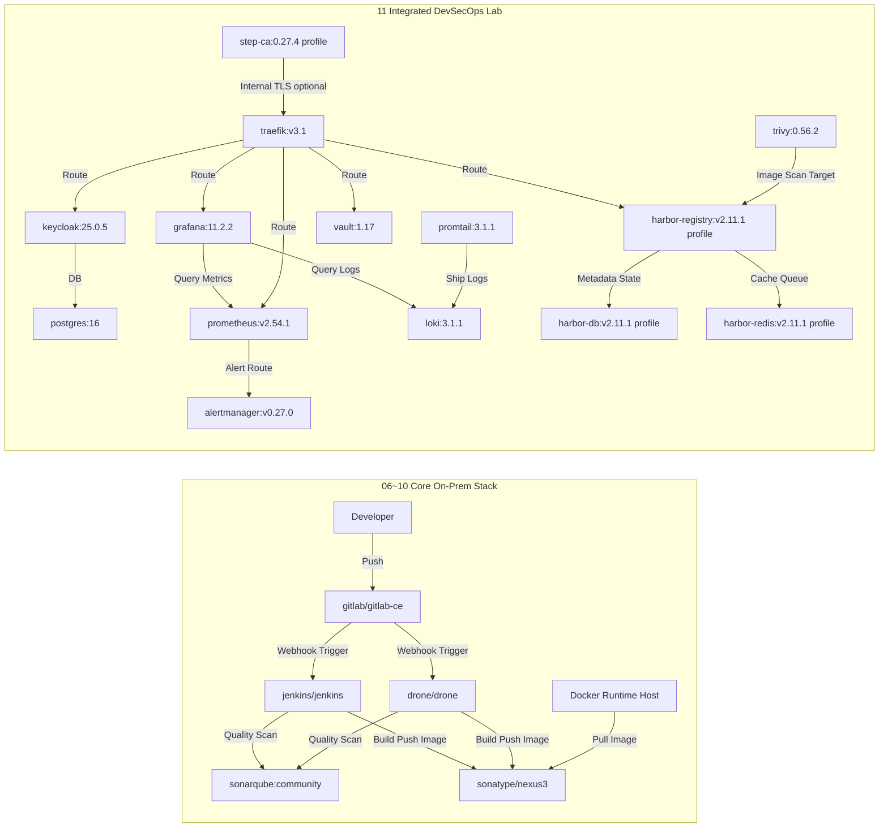

# 🐳 Docker Class Master — 动手实验室指南（中文）

> 🇺🇸 [English](./README.en.md) · 🇰🇷 [한국어](./README.ko.md) · 🇯🇵 [日本語](./README.ja.md) · 🇨🇳 中文

---

## 目录
- [1. 学习路线图](#1-学习路线图)
- [2. Docker Desktop 快速控制](#2-docker-desktop-快速控制)
- [3. 架构概览](#3-架构概览)
- [4. 本地部署最低资源估算](#4-本地部署最低资源估算)
- [5. 运维进阶扩展栈](#5-运维进阶扩展栈)
- [6. 集成依赖关系图](#6-集成依赖关系图)
- [7. WSL 端口 80 故障排查](#7-wsl-端口-80-故障排查)
- [8. Docker 镜像列表](#8-docker-镜像列表)
- [9. 目标读者与落地路线图](#9-目标读者与落地路线图)
- [10. 扩展课程地图（12~25）](#10-扩展课程地图1225)
- [11. 共享资源目录](#11-共享资源目录)

---

## 🔬 实验室简介

本仓库旨在以**动手实验（Hands-On Lab）**的形式，从 Docker 基础到构建完整的本地 DevSecOps 平台，系统地进行学习。

| 项目 | 内容 |
|---|---|
| 实验环境 | Docker Desktop（Windows/Mac）或 Linux Docker Engine |
| 前置条件 | 已安装 Docker、联网、最低 8 GB 内存 |
| 实验方式 | 按文件夹逐步推进，直接执行 CLI 命令，验证结果 |
| 最终目标 | 构建完整的本地 CI/CD + 安全 + 可观测性流水线 |

---

## 1. 学习路线图

| 步骤 | 主题 | 链接 |
|---|---|---|
| 01 | Docker 简介 | [01-Docker-Introduction](./01-Docker-Introduction/README.md) |
| 02 | Docker 安装 | [02-Docker-Installation](./02-Docker-Installation/README.md) |
| 03 | 从 Docker Hub 拉取并运行镜像 | [03-Pull-from-DockerHub-and-Run-Docker-Images](./03-Pull-from-DockerHub-and-Run-Docker-Images/README.md) |
| 04 | 构建、运行并推送镜像 | [04-Build-new-Docker-Image-and-Run-and-Push-to-DockerHub](./04-Build-new-Docker-Image-and-Run-and-Push-to-DockerHub/README.md) |
| 05 | 核心 Docker 命令 | [05-Essential-Docker-Commands](./05-Essential-Docker-Commands/README.md) |
| 06 | Jenkins 本地部署 | [06-Jenkins-Server-On-Prem](./06-Jenkins-Server-On-Prem/README.md) |
| 07 | GitLab CE 本地部署 | [07-GitLab-CE-On-Prem](./07-GitLab-CE-On-Prem/README.md) |
| 08 | SonarQube 本地部署 | [08-SonarQube-On-Prem](./08-SonarQube-On-Prem/README.md) |
| 09 | Nexus Repository 本地部署 | [09-Nexus-Repository-On-Prem](./09-Nexus-Repository-On-Prem/README.md) |
| 10 | Drone CI 本地部署 | [10-Drone-CI-On-Prem](./10-Drone-CI-On-Prem/README.md) |
| 11 | 集成 DevSecOps 实验室 | [11-Integrated-DevSecOps-Lab](./11-Integrated-DevSecOps-Lab/README.md) |
| 12 | Advanced Day01：容器基础 | [12-Advanced-Day01-Container-Basics](./12-Advanced-Day01-Container-Basics/README.md) |
| 13 | Advanced Day02：容器深入 | [13-Advanced-Day02-Container-DeepDive](./13-Advanced-Day02-Container-DeepDive/README.md) |
| 14 | Advanced Day03：镜像构建基础 | [14-Advanced-Day03-Image-Build](./14-Advanced-Day03-Image-Build/README.md) |
| 15 | Advanced Day04：镜像优化 | [15-Advanced-Day04-Image-Optimization](./15-Advanced-Day04-Image-Optimization/README.md) |
| 16 | Advanced Day05：网络 | [16-Advanced-Day05-Networking](./16-Advanced-Day05-Networking/README.md) |
| 17 | Advanced Day06：存储与备份 | [17-Advanced-Day06-Storage-Backup](./17-Advanced-Day06-Storage-Backup/README.md) |
| 18 | Advanced Day07：Compose 实战 | [18-Advanced-Day07-Compose-Practice](./18-Advanced-Day07-Compose-Practice/README.md) |
| 19 | Advanced Day08：调试与运维 | [19-Advanced-Day08-Debugging-Operations](./19-Advanced-Day08-Debugging-Operations/README.md) |
| 20 | Advanced Day09：Jenkins CI | [20-Advanced-Day09-Jenkins-CI](./20-Advanced-Day09-Jenkins-CI/README.md) |
| 21 | OnPrem Solution: Odoo | [21-OnPrem-Solution-Odoo](./21-OnPrem-Solution-Odoo/README.md) |
| 22 | OnPrem Solution: ERPNext | [22-OnPrem-Solution-ERPNext](./22-OnPrem-Solution-ERPNext/README.md) |
| 23 | OnPrem Solution: Tryton | [23-OnPrem-Solution-Tryton](./23-OnPrem-Solution-Tryton/README.md) |
| 24 | OnPrem Solution: Taiga | [24-OnPrem-Solution-Taiga](./24-OnPrem-Solution-Taiga/README.md) |
| 25 | OnPrem Solution: Zulip | [25-OnPrem-Solution-Zulip](./25-OnPrem-Solution-Zulip/README.md) |

---

## 2. Docker Desktop 快速控制

### CLI
```bash
# 查看状态（4.37+）
docker desktop status

# 启动 / 重启 / 停止
docker desktop start
docker desktop restart
docker desktop stop

# 查看日志
docker desktop logs
```

### PowerShell
```powershell
# 终止所有 Docker 相关进程
Get-Process "*docker*" -ErrorAction SilentlyContinue | Stop-Process -Force

# 重新启动 Docker Desktop UI
Start-Process "C:\Program Files\Docker\Docker\Docker Desktop.exe"
```

---

## 3. 架构概览

### 核心平台层
| 层级 | 组件 |
|---|---|
| Container Runtime | Docker Engine |
| SCM | GitLab CE |
| CI | Jenkins、Drone CI |
| Quality Gate | SonarQube |
| Artifact Registry | Nexus Repository OSS（或 Docker Hub/Harbor） |
| Runtime Workload | Nginx、Spring Boot 等 |

### 标准流程（Reference Flow）
1. 开发者将代码推送到 GitLab CE
2. 触发 Jenkins 或 Drone CI 流水线
3. 执行 SonarQube 代码质量检查
4. 构建 Docker 镜像并推送至 Nexus（或 Docker Hub）
5. 运行节点拉取镜像并部署

> [!TIP]
> 核心链路为：`GitLab -> Jenkins/Drone -> SonarQube -> Nexus -> Docker Runtime`

### 推荐网络区域
- `Zone 1 (Dev)`：开发者 PC，本地 Docker
- `Zone 2 (CI)`：GitLab、Jenkins/Drone、SonarQube
- `Zone 3 (Artifact)`：Nexus/Harbor
- `Zone 4 (Runtime)`：服务容器运行节点
- `Zone 5 (Ops)`：监控、日志、备份、安全

推荐策略:
- CI Zone → Artifact Zone：允许推送
- Runtime Zone → Artifact Zone：允许拉取
- Dev Zone → Runtime Zone：限制直接访问

---

## 4. 本地部署最低资源估算

> [!IMPORTANT]
> 以下数值为单节点实验/PoC 的最低基准。生产环境建议至少预留 1.5~2 倍资源余量。

### 范围说明
- 第 06~10 章：Jenkins、GitLab CE、SonarQube、Nexus、Drone
- 第 11 章：Integrated DevSecOps Lab（`docker-compose.yml`）基础/可选 Profile

### 各镜像最低计算资源
| 角色 | Docker 镜像 | 最低 vCPU | 最低 RAM | 最低磁盘 | 备注 |
|---|---|---:|---:|---:|---|
| CI | `jenkins/jenkins:lts-jdk17` | 2 | 4 GB | 50 GB | 需考虑插件/工作区增长 |
| SCM | `gitlab/gitlab-ce:17.5.2-ce.0` | 4 | 8 GB | 100 GB | 反映实际最低余量 |
| Code Quality | `sonarqube:community` | 2 | 4 GB | 50 GB | 生产建议外接 PostgreSQL |
| Artifact | `sonatype/nexus3:3.70.1` | 2 | 4 GB | 100 GB | 注意 Blob 存储增长 |
| CI（轻量） | `drone/drone:2` | 1 | 1 GB | 20 GB | Runner 需单独估算 |
| Reverse Proxy | `traefik:v3.1` | 1 | 1 GB | 10 GB | 含证书/访问日志 |
| DB | `postgres:16` | 1 | 2 GB | 20 GB | Keycloak 后端数据库 |
| IAM | `quay.io/keycloak/keycloak:25.0.5` | 1 | 2 GB | 10 GB | 用户增加时需扩容 |
| Secrets | `hashicorp/vault:1.17` | 1 | 1 GB | 10 GB | 实验使用 Dev 模式 |
| Scanner | `aquasec/trivy:0.56.2` | 1 | 1 GB | 10 GB | 扫描时存在瞬时峰值 |
| Metrics | `prom/prometheus:v2.54.1` | 2 | 2 GB | 30 GB | 磁盘随保留期线性增长 |
| Alert | `prom/alertmanager:v0.27.0` | 1 | 1 GB | 5 GB | 告警路由 |
| Dashboard | `grafana/grafana:11.2.2` | 1 | 1 GB | 10 GB | 仪表盘/插件存储 |
| Logs | `grafana/loki:3.1.1` | 2 | 2 GB | 30 GB | 日志保留策略关键 |
| Log Agent | `grafana/promtail:3.1.1` | 1 | 1 GB | 5 GB | 主机日志采集 |
| Private CA（可选） | `smallstep/step-ca:0.27.4` | 1 | 1 GB | 5 GB | `private-ca` profile |
| Harbor DB（可选） | `goharbor/harbor-db:v2.11.1` | 1 | 2 GB | 20 GB | `harbor` profile |
| Harbor Redis（可选） | `goharbor/redis-photon:v2.11.1` | 1 | 1 GB | 10 GB | `harbor` profile |
| Harbor Registry（可选） | `goharbor/registry-photon:v2.11.1` | 2 | 2 GB | 80 GB | `harbor` profile |

### 合计最低规格（单节点）
| 场景 | 最低 vCPU 合计 | 最低 RAM 合计 | 最低磁盘合计 |
|---|---:|---:|---:|
| 第 06~10 章核心栈 | 11 | 21 GB | 320 GB |
| 第 11 章基础 profile | 12 | 14 GB | 140 GB |
| 第 11 章 + `private-ca` + `harbor` profile | 17 | 20 GB | 255 GB |

额外推荐预留：`2 vCPU`、`4 GB RAM`、`30 GB`（宿主机 OS + Docker）

---

## 5. 运维进阶扩展栈

### 安全/访问控制
- Keycloak：SSO 与集中身份认证
- HashiCorp Vault：密钥集中管理
- Trivy：镜像漏洞扫描自动化

### 可观测性
- Prometheus + Grafana：指标/仪表盘
- Loki + Promtail（或 EFK/ELK）：日志采集/分析
- Alertmanager：告警自动化

### 网络/流量
- Traefik / Nginx Proxy Manager：反向代理，TLS 终端
- 基于私有 CA 的证书运维策略

### 镜像治理
- Harbor：内部镜像仓库 + 漏洞扫描 + 策略管理
- 可与 Nexus 并用或替代

### 备份/容灾
- 定期备份 GitLab、SonarQube、Nexus 的卷/数据库
- 使用 MinIO 等对象存储进行归档

---

## 6. 集成依赖关系图



估算前提:
- 单一 Docker 主机，最低实验室基准
- 未考虑 HA、长期数据保留和高负载场景
- 磁盘优先从 GitLab/SonarQube/Nexus 开始扩展

---

## 7. WSL 端口 80 故障排查

### 1) 查找占用端口 80 的进程
```bash
# 查看正在监听 80 端口的进程
sudo ss -ltnp 'sport = :80'

# 查看进程/用户/文件描述符详情
sudo lsof -iTCP:80 -sTCP:LISTEN -n -P
```

### 2) 停止进程
```bash
# 方式 A：停止服务（以 nginx 为例）
sudo systemctl stop nginx 2>/dev/null || sudo service nginx stop

# 方式 B：按 PID 强制终止（示例）
sudo kill -9 197
```

### 3) 确认端口已释放
```bash
sudo ss -ltnp 'sport = :80'
```

> [!WARNING]
> 仅在万不得已时使用 `kill -9`，尽量优先通过服务正常停止来释放端口。

---

## 8. Docker 镜像列表

| 应用程序 | Docker 镜像 |
|---|---|
| Nginx | `nginx` |
| 自定义 Nginx | `stacksimplify/mynginx_image1` |
| Spring Boot HelloWorld | `stacksimplify/dockerintro-springboot-helloworld-rest-api` |
| Jenkins LTS | `jenkins/jenkins:lts-jdk17` |
| GitLab CE | `gitlab/gitlab-ce:17.5.2-ce.0` |
| SonarQube Community | `sonarqube:community` |
| Nexus Repository OSS | `sonatype/nexus3:3.70.1` |
| Drone CI | `drone/drone:2` |

---

## 9. 目标读者与落地路线图

### 适用对象
- 初次学习 Docker 的工程师
- 开始构建本地 DevOps/Platform 环境的团队
- 希望快速了解工具间连接结构的 Solution Architect

### 分阶段落地
1. **Phase 1（基础/PoC）**
   - 完成第 1~10 步实验
   - 在 Jenkins/Drone 中选定一个标准 CI 工具
2. **Phase 2（标准化）**
   - 制定分支策略、流水线模板、SonarQube 质量门禁标准
   - 整理 Nexus 仓库结构（按团队/环境划分）
3. **Phase 3（运维稳定化）**
   - 接入监控/日志/告警
   - 开展备份/恢复演练，编写事故处理手册
4. **Phase 4（安全加固）**
   - 引入 SSO、密钥集中管理、镜像扫描/签名策略

---

## 10. 扩展课程地图（12~25）

按难度排列的扩展实验结构:
- `12~20`：Advanced Day01~Day09
- `21~25`：本地解决方案源码学习（Odoo、ERPNext、Tryton、Taiga、Zulip）

### Advanced 部分（12~20）
| 编号 | 文件夹 | 核心主题 |
|---|---|---|
| 12 | `12-Advanced-Day01-Container-Basics` | Docker 基础/首次运行 |
| 13 | `13-Advanced-Day02-Container-DeepDive` | 进程/资源/IO |
| 14 | `14-Advanced-Day03-Image-Build` | Dockerfile/镜像构建 |
| 15 | `15-Advanced-Day04-Image-Optimization` | 多阶段/优化 |
| 16 | `16-Advanced-Day05-Networking` | 网桥/DNS/通信 |
| 17 | `17-Advanced-Day06-Storage-Backup` | 卷/备份/恢复 |
| 18 | `18-Advanced-Day07-Compose-Practice` | Compose 实战 |
| 19 | `19-Advanced-Day08-Debugging-Operations` | 故障分析/Runbook |
| 20 | `20-Advanced-Day09-Jenkins-CI` | CI 流水线 |

### OnPrem 解决方案部分（21~25）
| 编号 | 文件夹 | 解决方案 |
|---|---|---|
| 21 | `21-OnPrem-Solution-Odoo` | Odoo |
| 22 | `22-OnPrem-Solution-ERPNext` | ERPNext |
| 23 | `23-OnPrem-Solution-Tryton` | Tryton |
| 24 | `24-OnPrem-Solution-Taiga` | Taiga |
| 25 | `25-OnPrem-Solution-Zulip` | Zulip |

---

## 11. 共享资源目录

除课程文件夹（12~25）外，合并仓库的共享资源维护在以下位置：

- `_shared-advanced-core/`
  - 共享模板/文档/Capstone（`templates`、`docs`、`capstone`）
  - `labs/dayXX` 软链接指向上级课程文件夹（12~20）
- `_shared-onprem-core/`
  - 集成编排文件（`docker-compose.yml`、`start.sh`、`stop.sh`、`sync-solutions.sh`）
  - `solutions/*` 软链接指向上级课程文件夹（21~25）

---

## 🔬 实验室操作提示

### 实验开始前检查清单
```bash
# 验证 Docker 正常运行
docker version
docker info

# 确认磁盘空余（建议 20 GB 以上）
df -h

# 提前检查端口冲突
sudo ss -ltnp | grep -E '80|443|8080|8443|9000|9090|3000'
```

### 实验结束后清理
```bash
# 批量删除已停止的容器
docker container prune -f

# 删除未使用的镜像
docker image prune -f

# 删除所有未使用资源（卷除外）
docker system prune -f
```

> [!TIP]
> 每个实验文件夹的 `README.md` 中都包含该实验的目标、命令和验证步骤的详细说明。
