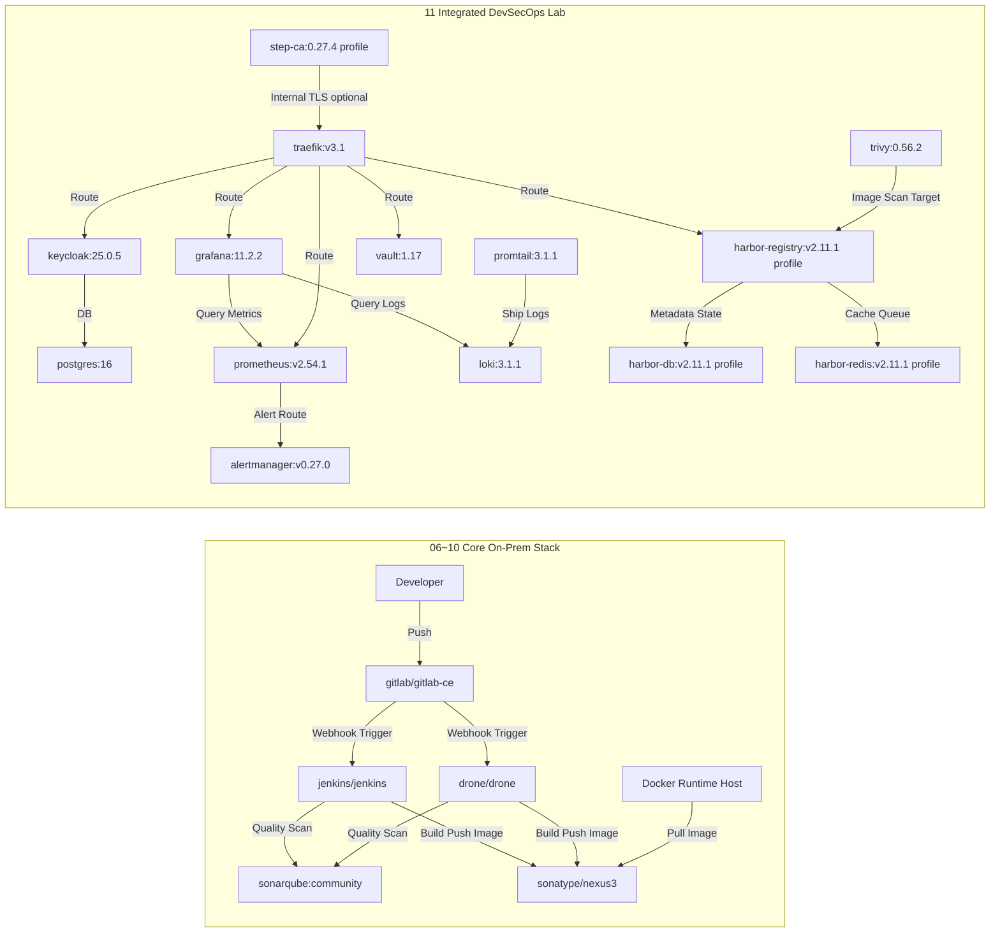

# 🐳 Docker Class Master

## 선수 repo - https://github.com/edumgt/edumgt-lab-init

## 목차
- [0. 시작 전 준비사항](#0-시작-전-준비사항)
- [1. 학습 로드맵](#1-학습-로드맵)
- [2. Docker Desktop 빠른 제어](#2-docker-desktop-빠른-제어)
- [3. 아키텍처 개요](#3-아키텍처-개요)
- [4. 온프렘 최소 자원 산정](#4-온프렘-최소-자원-산정)
- [5. 운영 고도화 확장 스택](#5-운영-고도화-확장-스택)
- [6. 통합 의존관계 다이어그램](#6-통합-의존관계-다이어그램)
- [7. WSL 포트 80 트러블슈팅](#7-wsl-포트-80-트러블슈팅)
- [8. Docker 이미지 목록](#8-docker-이미지-목록)
- [9. 대상 독자와 도입 로드맵](#9-대상-독자와-도입-로드맵)
- [10. 확장 커리큘럼 맵 (12~26)](#10-확장-커리큘럼-맵-1226)
- [11. 공용 리소스 폴더](#11-공용-리소스-폴더)
- [12. Python + 금융공학 RAG Lab](#12-python--금융공학-rag-lab)
- [13. Vector DB 원리와 Docker 실습](#13-vector-db-원리와-docker-실습)
- [14. 멀티 모델 & sLLM Docker 서빙](#14-멀티-모델--sllm-docker-서빙)

---

## 0. 시작 전 준비사항

> [!IMPORTANT]
> 실습을 시작하기 전에 아래 항목을 모두 확인하세요. 기술 스택 이해도와 PC 사양에 따라 진행 가능한 단계가 달라집니다.

---

### 0-1. 개인별 습득해야 할 기술 스택

#### 🟢 기초 (01~05장 필수)

| 영역 | 필요 역량 | 참고 자료 |
|---|---|---|
| CLI / 터미널 | 명령줄 기본 사용법 (pwd, ls, cd, cat, grep 등) | [Linux 기초 명령어](https://ubuntu.com/tutorials/command-line-for-beginners) |
| Git | clone, add, commit, push, pull 기본 흐름 | [Git 공식 문서](https://git-scm.com/doc) |
| Linux 기초 | 파일 권한, 환경변수, 프로세스, 패키지 관리(apt/yum) | — |
| 네트워크 기초 | IP, 포트, DNS, TCP/UDP 개념 이해 | — |
| Docker 기초 | 이미지/컨테이너/볼륨/네트워크 개념, Dockerfile 문법 | [Docker 공식 튜토리얼](https://docs.docker.com/get-started/) |

#### 🟡 중급 (06~11장, Advanced 12~20장)

| 영역 | 필요 역량 |
|---|---|
| Docker Compose | `docker-compose.yml` 작성, 멀티 컨테이너 의존 관계 제어 |
| CI/CD 개념 | 파이프라인 단계(빌드→테스트→배포), Webhook 트리거 이해 |
| Jenkins | Declarative Pipeline(Jenkinsfile) 작성 기초 |
| GitLab | 브랜치 전략, Merge Request, CI/CD 연동 개념 |
| SonarQube | 품질 게이트, 코드 커버리지 개념 |
| Nexus / Harbor | 아티팩트·이미지 저장소 구조 이해 |
| 역방향 프록시 | Traefik / Nginx 라우팅, TLS 종료 개념 |
| 보안 기초 | 시크릿 관리(Vault), SSO(Keycloak), 이미지 취약점 스캔(Trivy) |
| 모니터링 | Prometheus 메트릭 수집, Grafana 대시보드, Loki 로그 집계 |

#### 🔴 심화 (21~28장, 선택)

| 영역 | 필요 역량 |
|---|---|
| ERP 솔루션 운영 | Odoo, ERPNext, Tryton 기본 아키텍처 이해 |
| Python 기초 | 스크립트 작성, 패키지 관리(pip), 가상환경(venv) |
| AI / LLM 기초 | 임베딩, 벡터 유사도, RAG(Retrieval-Augmented Generation) 개념 |
| Vector DB | Qdrant, Chroma, Weaviate, pgvector 기본 사용법 |
| sLLM 서빙 | Ollama 모델 Pull·서빙, REST API 호출, GPU 드라이버 설정 |

---

### 0-2. 권장 PC 사양

> [!NOTE]
> 단계별 실습 범위에 따라 필요한 사양이 크게 다릅니다. 아래 표를 기준으로 자신의 진행 범위를 확인하세요.

#### 단계별 최소 / 권장 사양

| 실습 단계 | 최소 CPU | 최소 RAM | 최소 디스크 | 권장 RAM | 권장 디스크 | 비고 |
|---|---:|---:|---:|---:|---:|---|
| **01~05장** (Docker 기초) | 4코어 | 8 GB | 50 GB | 16 GB | 100 GB | Docker Desktop 구동 기준 |
| **06~10장** (핵심 On-Prem 스택) | 8코어 | 16 GB | 400 GB | 32 GB | 600 GB | GitLab 단독 최소 8 GB RAM |
| **11장** (통합 DevSecOps Lab) | 8코어 | 32 GB | 300 GB | 64 GB | 500 GB | 전체 프로파일 동시 기동 기준 |
| **12~20장** (Advanced) | 8코어 | 16 GB | 200 GB | 32 GB | 400 GB | Compose 멀티 컨테이너 구동 |
| **21~25장** (OnPrem 솔루션) | 8코어 | 16 GB | 200 GB | 32 GB | 400 GB | Odoo/ERPNext DB 포함 |
| **27장** (Vector DB) | 4코어 | 8 GB | 50 GB | 16 GB | 100 GB | 경량 Vector DB 실습 |
| **28장** (sLLM 서빙, CPU) | 8코어 | 16 GB | 100 GB | 32 GB | 200 GB | gemma3:2b 기준 |
| **28장** (sLLM 서빙, GPU) | 8코어 | 32 GB | 200 GB | 64 GB | 500 GB | NVIDIA GPU 8 GB VRAM 이상 |

#### OS별 설치 환경

| 운영체제 | 권장 설정 |
|---|---|
| **Windows 10/11** | WSL 2 + Docker Desktop 최신 버전, RAM 16 GB 이상 권장 |
| **macOS (Intel)** | Docker Desktop for Mac, Rosetta 비활성화 권장 |
| **macOS (Apple Silicon / M1~M4)** | Docker Desktop ARM 빌드, `platform: linux/amd64` 에뮬레이션 주의 |
| **Ubuntu 22.04 LTS** | Docker Engine + Docker Compose Plugin 직접 설치, WSL 불필요 |

> [!TIP]
> **전체 커리큘럼(01~28장)을 모두 진행하려면** CPU 12코어 이상, RAM 32 GB 이상, NVMe SSD 1 TB 이상을 권장합니다.
> 클라우드 VM(AWS EC2, GCP Compute, Azure VM)을 활용하면 로컬 사양 제약을 해결할 수 있습니다.

---

### 0-3. 가입해야 할 플랫폼

| 플랫폼 | 용도 | 무료 플랜 여부 | 가입 URL |
|---|---|---|---|
| **Docker Hub** | 이미지 Pull/Push, 공개 레지스트리 | ✅ 무료 (Pull 제한 있음) | [hub.docker.com](https://hub.docker.com) |
| **GitHub** | 선수 repo(`edumgt-lab-init`) 및 소스 관리 | ✅ 무료 | [github.com](https://github.com) |
| **GitLab.com** (선택) | 클라우드 GitLab 연습용 (로컬 CE와 병행 가능) | ✅ 무료 (Free tier) | [gitlab.com](https://gitlab.com) |
| **SonarCloud** (선택) | 공개 저장소 코드 품질 분석 클라우드판 | ✅ 오픈소스 무료 | [sonarcloud.io](https://sonarcloud.io) |
| **Hugging Face** (선택) | sLLM 모델 다운로드 (28장) | ✅ 무료 | [huggingface.co](https://huggingface.co) |
| **AWS / GCP / Azure** (선택) | 클라우드 VM에서 온프레미스 실습 환경 구성 | ❌ 유료 (프리 티어 한정 무료) | 각 클라우드 콘솔 참고 |

> [!NOTE]
> **로컬 PC에서만 실습**하는 경우 Docker Hub와 GitHub 계정만으로도 01~28장 전 과정을 진행할 수 있습니다.

---

### 0-4. 예상 비용 (카드 청구 예상금액)

#### 로컬 PC 실습 (클라우드 미사용)

| 항목 | 예상 비용 | 비고 |
|---|---|---|
| Docker Hub (Personal) | **무료** | Pull 횟수 제한 있음 (6시간당 100회) |
| Docker Hub (Pro) | **$9/월** ≈ 13,000원/월 | 무제한 Pull, 개인 레지스트리 무제한 | 
| GitHub | **무료** | 공개/비공개 저장소 모두 무료 |
| GitLab.com (Free) | **무료** | CI 월 400분 무료 제공 |
| 전기 요금 | **약 5,000~20,000원/월** | 24시간 상시 운영 기준, PC 소비전력·전기요금에 따라 상이 |
| **소계 (기본)** | **월 0~22,000원** | Docker Hub 무료 티어 사용 시 실질 비용 최소화 가능 |

#### 클라우드 VM 활용 (선택)

> [!WARNING]
> 아래 비용은 2025년 기준 대략적인 추정치이며, 사용 시간·리전·옵션에 따라 달라집니다. 반드시 각 클라우드 콘솔의 요금 계산기를 사용해 정확한 금액을 확인하세요.

| 시나리오 | AWS EC2 예시 | GCP Compute 예시 | Azure VM 예시 | 월 예상 비용 |
|---|---|---|---|---|
| **기초 실습 전용** (01~05장) | t3.medium (2vCPU/4GB) | e2-medium (2vCPU/4GB) | B2s (2vCPU/4GB) | 약 **25,000~40,000원/월** |
| **핵심 On-Prem 스택** (06~11장) | m6i.2xlarge (8vCPU/32GB) | n2-standard-8 (8vCPU/32GB) | D8s v5 (8vCPU/32GB) | 약 **200,000~350,000원/월** |
| **전체 통합 실습** (01~28장) | m6i.4xlarge (16vCPU/64GB) + SSD 1TB | n2-standard-16 (16vCPU/64GB) | D16s v5 (16vCPU/64GB) | 약 **500,000~900,000원/월** |
| **sLLM GPU 서빙** (28장) | g4dn.xlarge (4vCPU/16GB, T4 GPU) | n1-standard-4 + T4 GPU | NC4as T4 v3 | 약 **150,000~350,000원/월** |

#### 비용 절감 팁

- **스팟/프리엠티블 인스턴스** 활용: AWS Spot, GCP Preemptible은 On-Demand 대비 60~80% 저렴합니다.
- **실습 후 즉시 중지**: VM을 사용하지 않을 때 중지(Stop)하면 컴퓨팅 비용이 발생하지 않습니다(스토리지 비용은 유지).
- **프리 티어 활용**: AWS 신규 계정은 12개월간 t2.micro(1vCPU/1GB) 무료 제공. 기초 실습(01~05장) 진행 가능.
- **Docker Hub 풀 제한 우회**: 로컬 Nexus Repository(09장)를 구축하면 Pull 횟수 제한 없이 이미지를 캐싱할 수 있습니다.
- **GitLab CE 자체 호스팅**: GitLab.com CI 무료 400분 한계를 우회하려면 07장에서 로컬 GitLab CE를 구축하세요.

#### 전체 커리큘럼 완주 시 예상 총비용

| 환경 | 기간 | 예상 총비용 |
|---|---|---|
| 로컬 PC (스펙 충족 시) | 1~3개월 | **5,000~60,000원** (전기 요금만) |
| 클라우드 (핵심 스택 위주) | 1~3개월 | **300,000~1,000,000원** |
| 클라우드 (전체 + GPU) | 1~3개월 | **1,000,000~3,000,000원** |

> [!TIP]
> 비용 부담을 최소화하려면 **로컬 PC(RAM 32 GB 이상)**를 우선 활용하고, GPU가 필요한 28장만 클라우드 GPU 인스턴스를 단기 사용하는 방식을 권장합니다.

---

## 1. 학습 로드맵

| 단계 | 주제 | 이동 |
|---|---|---|
| 01 | Docker 소개 | [01-Docker-Introduction](./01-Docker-Introduction/README.md) |
| 02 | Docker 설치 | [02-Docker-Installation](./02-Docker-Installation/README.md) |
| 03 | Docker Hub 이미지 Pull/Run | [03-Pull-from-DockerHub-and-Run-Docker-Images](./03-Pull-from-DockerHub-and-Run-Docker-Images/README.md) |
| 04 | 이미지 Build/Run/Push | [04-Build-new-Docker-Image-and-Run-and-Push-to-DockerHub](./04-Build-new-Docker-Image-and-Run-and-Push-to-DockerHub/README.md) |
| 05 | 핵심 Docker 명령어 | [05-Essential-Docker-Commands](./05-Essential-Docker-Commands/README.md) |
| 06 | Jenkins 온프레미스 구축 | [06-Jenkins-Server-On-Prem](./06-Jenkins-Server-On-Prem/README.md) |
| 07 | GitLab CE 온프레미스 구축 | [07-GitLab-CE-On-Prem](./07-GitLab-CE-On-Prem/README.md) |
| 08 | SonarQube 온프레미스 구축 | [08-SonarQube-On-Prem](./08-SonarQube-On-Prem/README.md) |
| 09 | Nexus Repository 온프레미스 구축 | [09-Nexus-Repository-On-Prem](./09-Nexus-Repository-On-Prem/README.md) |
| 10 | Drone CI 온프레미스 구축 | [10-Drone-CI-On-Prem](./10-Drone-CI-On-Prem/README.md) |
| 11 | 통합 DevSecOps Lab | [11-Integrated-DevSecOps-Lab](./11-Integrated-DevSecOps-Lab/README.md) |
| 12 | Advanced Day01: Docker 개요 & 첫 걸음 | [12-Advanced-Day01-Container-Basics](./12-Advanced-Day01-Container-Basics/README.md) |
| 13 | Advanced Day02: 컨테이너 심화 | [13-Advanced-Day02-Container-DeepDive](./13-Advanced-Day02-Container-DeepDive/README.md) |
| 14 | Advanced Day03: 이미지 빌드 기초 | [14-Advanced-Day03-Image-Build](./14-Advanced-Day03-Image-Build/README.md) |
| 15 | Advanced Day04: 이미지 최적화 | [15-Advanced-Day04-Image-Optimization](./15-Advanced-Day04-Image-Optimization/README.md) |
| 16 | Advanced Day05: 네트워킹 | [16-Advanced-Day05-Networking](./16-Advanced-Day05-Networking/README.md) |
| 17 | Advanced Day06: 스토리지/백업복구 | [17-Advanced-Day06-Storage-Backup](./17-Advanced-Day06-Storage-Backup/README.md) |
| 18 | Advanced Day07: Compose 실전 | [18-Advanced-Day07-Compose-Practice](./18-Advanced-Day07-Compose-Practice/README.md) |
| 19 | Advanced Day08: 디버깅/운영 | [19-Advanced-Day08-Debugging-Operations](./19-Advanced-Day08-Debugging-Operations/README.md) |
| 20 | Advanced Day09: Jenkins CI | [20-Advanced-Day09-Jenkins-CI](./20-Advanced-Day09-Jenkins-CI/README.md) |
| 21 | OnPrem Solution: Odoo | [21-OnPrem-Solution-Odoo](./21-OnPrem-Solution-Odoo/README.md) |
| 22 | OnPrem Solution: ERPNext | [22-OnPrem-Solution-ERPNext](./22-OnPrem-Solution-ERPNext/README.md) |
| 23 | OnPrem Solution: Tryton | [23-OnPrem-Solution-Tryton](./23-OnPrem-Solution-Tryton/README.md) |
| 24 | OnPrem Solution: Taiga | [24-OnPrem-Solution-Taiga](./24-OnPrem-Solution-Taiga/README.md) |
| 25 | OnPrem Solution: Zulip | [25-OnPrem-Solution-Zulip](./25-OnPrem-Solution-Zulip/README.md) |
| 26 | Advanced Day10: Python + 금융공학 RAG | [26-Advanced-Day10-Python-Finance-RAG](./26-Advanced-Day10-Python-Finance-RAG/README.md) |
| 27 | Vector DB Docker Playground | [27-Vector-DB-Docker-Playground](./27-Vector-DB-Docker-Playground/README.md) |
| 28 | 멀티 모델 & sLLM Docker 서빙 | [28-Multi-Model-sLLM-Serving](./28-Multi-Model-sLLM-Serving/README.md) |

---

## 2. Docker Desktop 빠른 제어

### CLI
```bash
# 상태 확인 (4.37+)
docker desktop status

# 시작 / 재시작 / 중지
docker desktop start
docker desktop restart
docker desktop stop

# 로그 확인
docker desktop logs
```

### PowerShell
```powershell
# Docker Desktop 관련 프로세스 종료
Get-Process "*docker*" -ErrorAction SilentlyContinue | Stop-Process -Force

# Docker Desktop UI 재실행
Start-Process "C:\Program Files\Docker\Docker\Docker Desktop.exe"
```

---

## 3. 아키텍처 개요

### 핵심 플랫폼 레이어
| 레이어 | 구성 요소 |
|---|---|
| Container Runtime | Docker Engine |
| SCM | GitLab CE |
| CI | Jenkins, Drone CI |
| Quality Gate | SonarQube |
| Artifact Registry | Nexus Repository OSS (또는 Docker Hub/Harbor) |
| Runtime Workload | Nginx, Spring Boot 등 |

### 표준 흐름 (Reference Flow)
1. 개발자가 GitLab CE에 코드 Push
2. Jenkins 또는 Drone CI 파이프라인 실행
3. SonarQube 품질 검사 수행
4. Docker 이미지 빌드 후 Nexus(또는 Docker Hub)로 Push
5. 운영 노드가 이미지 Pull 후 배포

> [!TIP]
> 기본 체인은 `GitLab -> Jenkins/Drone -> SonarQube -> Nexus -> Docker Runtime` 으로 이해하면 됩니다.

### 권장 네트워크 존
- `Zone 1 (Dev)`: 개발자 PC, 로컬 Docker
- `Zone 2 (CI)`: GitLab, Jenkins/Drone, SonarQube
- `Zone 3 (Artifact)`: Nexus/Harbor
- `Zone 4 (Runtime)`: 서비스 컨테이너 실행 노드
- `Zone 5 (Ops)`: 모니터링, 로깅, 백업, 보안

권장 정책:
- CI Zone -> Artifact Zone: Push 허용
- Runtime Zone -> Artifact Zone: Pull 허용
- Dev Zone -> Runtime Zone: 직접 접근 제한

---

## 4. 온프렘 최소 자원 산정

> [!IMPORTANT]
> 아래 수치는 단일 노드 실습/PoC 최소 기준입니다. 운영 환경은 최소 1.5~2배 여유 자원을 권장합니다.

### 기준 범위
- 06~10장: Jenkins, GitLab CE, SonarQube, Nexus, Drone
- 11장: Integrated DevSecOps Lab (`docker-compose.yml`) 기본/선택 프로파일
- 기준 파일:
  - `06-Jenkins-Server-On-Prem/Dockerfile`
  - `07-GitLab-CE-On-Prem/Dockerfile`
  - `08-SonarQube-On-Prem/Dockerfile`
  - `09-Nexus-Repository-On-Prem/Dockerfile`
  - `10-Drone-CI-On-Prem/Dockerfile`
  - `11-Integrated-DevSecOps-Lab/docker-compose.yml`

### 이미지별 최소 컴퓨팅 자원
| 구분 | Docker 이미지 | 최소 vCPU | 최소 RAM | 최소 디스크(볼륨) | 비고 |
|---|---|---:|---:|---:|---|
| CI | `jenkins/jenkins:lts-jdk17` | 2 | 4 GB | 50 GB | 플러그인/워크스페이스 증가 고려 |
| SCM | `gitlab/gitlab-ce:17.5.2-ce.0` | 4 | 8 GB | 100 GB | 실무 최소 여유 반영 |
| Code Quality | `sonarqube:community` | 2 | 4 GB | 50 GB | 운영은 외부 PostgreSQL 연동 권장 |
| Artifact | `sonatype/nexus3:3.70.1` | 2 | 4 GB | 100 GB | Blob 저장 증가 유의 |
| CI (경량) | `drone/drone:2` | 1 | 1 GB | 20 GB | Runner 별도 산정 필요 |
| Reverse Proxy | `traefik:v3.1` | 1 | 1 GB | 10 GB | 인증서/액세스 로그 포함 |
| DB | `postgres:16` | 1 | 2 GB | 20 GB | Keycloak 백엔드 DB |
| IAM | `quay.io/keycloak/keycloak:25.0.5` | 1 | 2 GB | 10 GB | 사용자 증가 시 확장 필요 |
| Secrets | `hashicorp/vault:1.17` | 1 | 1 GB | 10 GB | 레포는 Dev 모드 |
| Scanner | `aquasec/trivy:0.56.2` | 1 | 1 GB | 10 GB | 스캔 시 순간 부하 증가 |
| Metrics | `prom/prometheus:v2.54.1` | 2 | 2 GB | 30 GB | 보관 기간에 비례해 디스크 증가 |
| Alert | `prom/alertmanager:v0.27.0` | 1 | 1 GB | 5 GB | 알림 라우팅 |
| Dashboard | `grafana/grafana:11.2.2` | 1 | 1 GB | 10 GB | 대시보드/플러그인 저장 |
| Logs | `grafana/loki:3.1.1` | 2 | 2 GB | 30 GB | 로그 보관 정책 핵심 |
| Log Agent | `grafana/promtail:3.1.1` | 1 | 1 GB | 5 GB | 호스트 로그 수집 |
| Private CA (옵션) | `smallstep/step-ca:0.27.4` | 1 | 1 GB | 5 GB | `private-ca` profile |
| Harbor DB (옵션) | `goharbor/harbor-db:v2.11.1` | 1 | 2 GB | 20 GB | `harbor` profile |
| Harbor Redis (옵션) | `goharbor/redis-photon:v2.11.1` | 1 | 1 GB | 10 GB | `harbor` profile |
| Harbor Registry (옵션) | `goharbor/registry-photon:v2.11.1` | 2 | 2 GB | 80 GB | `harbor` profile |

### 합산 최소 사양 (단일 노드)
| 시나리오 | 최소 vCPU 합계 | 최소 RAM 합계 | 최소 디스크 합계 |
|---|---:|---:|---:|
| 06~10장 핵심 스택 (Jenkins+GitLab+Sonar+Nexus+Drone) | 11 | 21 GB | 320 GB |
| 11장 기본 프로파일 (Traefik~Promtail) | 12 | 14 GB | 140 GB |
| 11장 + `private-ca` + `harbor` 프로파일 | 17 | 20 GB | 255 GB |

추가 권장 오버헤드: `2 vCPU`, `4 GB RAM`, `30 GB` (호스트 OS + Docker)

---

## 5. 운영 고도화 확장 스택

### 보안/접근제어
- Keycloak: SSO 및 중앙 인증
- HashiCorp Vault: 비밀정보 중앙관리
- Trivy: 이미지 취약점 스캔 자동화

### 관측성
- Prometheus + Grafana: 메트릭/대시보드
- Loki + Promtail (또는 EFK/ELK): 로그 수집/분석
- Alertmanager: 알림 자동화

### 네트워크/트래픽
- Traefik / Nginx Proxy Manager: 리버스 프록시, TLS 종료
- 사설 CA 기반 인증서 운영 전략 수립

### 이미지 거버넌스
- Harbor: 내부 레지스트리 + 취약점 스캔 + 정책
- Nexus와 병행 또는 대체 가능

### 백업/DR
- GitLab, SonarQube, Nexus 볼륨/DB 정기 백업
- MinIO 등 오브젝트 스토리지 기반 보관

---

## 6. 통합 의존관계 다이어그램



산정 가정:
- 단일 Docker Host 최소 실습 기준
- HA/장기보관/대규모 부하는 미반영
- 디스크는 GitLab/SonarQube/Nexus부터 우선 확장 고려

---

## 7. WSL 포트 80 트러블슈팅

### 1) 점유 프로세스 확인
```bash
# LISTEN 중인 80 포트 프로세스
sudo ss -ltnp 'sport = :80'

# 프로세스/사용자/FD 상세 확인
sudo lsof -iTCP:80 -sTCP:LISTEN -n -P
```

### 2) 점유 프로세스 종료
```bash
# 방법 A: 서비스 종료 (예: nginx)
sudo systemctl stop nginx 2>/dev/null || sudo service nginx stop

# 방법 B: PID 강제 종료 (예시)
sudo kill -9 197
```

### 3) 해제 확인
```bash
sudo ss -ltnp 'sport = :80'
```

> [!WARNING]
> `kill -9`는 마지막 수단으로만 사용하고, 가능하면 서비스 정상 종료를 우선 사용하세요.

---

## 8. Docker 이미지 목록

| 애플리케이션 | Docker 이미지 |
|---|---|
| Nginx | `nginx` |
| 커스텀 Nginx | `stacksimplify/mynginx_image1` |
| Spring Boot HelloWorld | `stacksimplify/dockerintro-springboot-helloworld-rest-api` |
| Jenkins LTS | `jenkins/jenkins:lts-jdk17` |
| GitLab CE | `gitlab/gitlab-ce:17.5.2-ce.0` |
| SonarQube Community | `sonarqube:community` |
| Nexus Repository OSS | `sonatype/nexus3:3.70.1` |
| Drone CI | `drone/drone:2` |
| Ollama | `ollama/ollama:latest` |
| Open WebUI | `ghcr.io/open-webui/open-webui:main` |

---

## 9. 대상 독자와 도입 로드맵

### 활용 대상
- Docker를 처음 학습하는 엔지니어
- 온프레미스 DevOps/Platform 구축을 시작하는 팀
- 도구 간 연결 구조를 빠르게 파악하려는 Solution Architect

### 단계별 도입
1. **Phase 1 (기본기/PoC)**
   - 1~10 단계 실습 완료
   - Jenkins/Drone 중 표준 CI 1개 선정
2. **Phase 2 (표준화)**
   - 브랜치 전략, 파이프라인 템플릿, Sonar 품질 게이트 표준화
   - Nexus 저장소 구조(팀/환경별) 정리
3. **Phase 3 (운영 안정화)**
   - 모니터링/로그/알림 연계
   - 백업/복구 리허설 및 장애 대응 Runbook 작성
4. **Phase 4 (보안 고도화)**
   - SSO, 비밀정보 중앙관리, 이미지 스캔/서명 정책 도입

---

## 10. 확장 커리큘럼 맵 (12~27)

난이도 순 확장 실습 구조:
- `12~20`: Advanced Day01~Day09
- `21~25`: OnPrem 솔루션별 소스 학습(odoo, erpnext, tryton, taiga, zulip)
- `26`: Python 기반 금융공학 RAG 실습
- `27`: 경량 오픈소스 Vector DB Docker 실습
- `28`: 멀티 모델 & sLLM Docker 서빙 (Gemma3, Llama 3, DeepSeek-R1)

### Advanced 파트 (12~20)
| 번호 | 폴더 | 핵심 주제 |
|---|---|---|
| 12 | `12-Advanced-Day01-Container-Basics` | Docker 기초/첫 실행 |
| 13 | `13-Advanced-Day02-Container-DeepDive` | 프로세스/자원/IO |
| 14 | `14-Advanced-Day03-Image-Build` | Dockerfile/이미지 빌드 |
| 15 | `15-Advanced-Day04-Image-Optimization` | 멀티스테이지/최적화 |
| 16 | `16-Advanced-Day05-Networking` | 브리지/DNS/통신 |
| 17 | `17-Advanced-Day06-Storage-Backup` | 볼륨/백업/복구 |
| 18 | `18-Advanced-Day07-Compose-Practice` | Compose 실전 |
| 19 | `19-Advanced-Day08-Debugging-Operations` | 장애 분석/Runbook |
| 20 | `20-Advanced-Day09-Jenkins-CI` | CI 파이프라인 |

### OnPrem 솔루션 파트 (21~25)
| 번호 | 폴더 | 솔루션 |
|---|---|---|
| 21 | `21-OnPrem-Solution-Odoo` | Odoo |
| 22 | `22-OnPrem-Solution-ERPNext` | ERPNext |
| 23 | `23-OnPrem-Solution-Tryton` | Tryton |
| 24 | `24-OnPrem-Solution-Taiga` | Taiga |
| 25 | `25-OnPrem-Solution-Zulip` | Zulip |

### Python + 금융공학 RAG 파트 (26)
| 번호 | 폴더 | 핵심 주제 |
|---|---|---|
| 26 | `26-Advanced-Day10-Python-Finance-RAG` | 금융공학 도메인 RAG(수집/청킹/검색/근거답변) |

### Vector DB Docker 파트 (27)
| 번호 | 폴더 | 핵심 주제 |
|---|---|---|
| 27 | `27-Vector-DB-Docker-Playground` | Qdrant/Chroma/Weaviate/pgvector 단일 실행 실습 |

### 멀티 모델 & sLLM 서빙 파트 (28)
| 번호 | 폴더 | 핵심 주제 |
|---|---|---|
| 28 | `28-Multi-Model-sLLM-Serving` | Ollama로 Gemma3/Llama3/DeepSeek-R1 CPU·GPU 서빙 |

---

## 11. 공용 리소스 폴더

커리큘럼 폴더(12~25)와 별도로, 원본 병합 레포의 공용 리소스는 아래에 유지합니다.

- `_shared-advanced-core/`
  - 공용 템플릿/문서/캡스톤 (`templates`, `docs`, `capstone`)
  - `labs/dayXX`는 상위 커리큘럼 폴더(12~20)로 연결되는 링크
- `_shared-onprem-core/`
  - 통합 오케스트레이션(`docker-compose.yml`, `start.sh`, `stop.sh`, `sync-solutions.sh`)
  - `solutions/*`는 상위 커리큘럼 폴더(21~25)로 연결되는 링크

---

## 12. Python + 금융공학 RAG Lab

추가된 `26-Advanced-Day10-Python-Finance-RAG` 폴더는 Python으로 RAG 핵심 구성요소를 직접 구현하는 금융공학 특화 실습입니다.

### 학습 범위
- 금융공학 문서 수집과 섹션/문단 기반 chunking
- TF-IDF 유사 스코어 기반 Top-K 검색
- 근거(citation) 포함 답변 생성
- 질의셋 기반 정확도/근거성/재현성 평가

### 커리큘럼 요약
| 모듈 | 주제 | 산출물 |
|---|---|---|
| 1 | RAG 아키텍처 이해 | 구성도 |
| 2 | 인덱싱 파이프라인 | 생성된 chunks |
| 3 | 검색 품질 실습 | Top-K 검색 결과 |
| 4 | 근거 기반 답변 | 답변 + citations |
| 5 | 평가 및 개선 | 개선 리포트 |

### 빠른 실행
```bash
# Docker
cd 26-Advanced-Day10-Python-Finance-RAG
docker compose up --build

# Local Python
cd 26-Advanced-Day10-Python-Finance-RAG/app
python3 -m venv .venv
source .venv/bin/activate
pip install -r requirements.txt
python src/run_lab.py
```

### 실습 질의 예시
- 듀레이션과 금리 민감도의 관계는?
- VaR와 Expected Shortfall 비교
- 유동성 리스크 대응 주문 전략
- 모델 리스크 통제와 감사 추적성

> [!TIP]
> Lab 상세 안내는 `26-Advanced-Day10-Python-Finance-RAG/README.md`를 참고하세요.

---

## 13. Vector DB 원리와 Docker 실습

### Vector DB 핵심 원리
- **임베딩(Vectorization)**: 텍스트/이미지 등을 고정 길이 벡터로 변환해 의미 유사성을 수치화합니다.
- **인덱싱(ANN)**: HNSW/IVF 같은 근사 최근접 탐색 인덱스로 대규모 벡터에서 빠르게 Top-K를 찾습니다.
- **유사도 계산**: Cosine, Dot Product, Euclidean 거리로 질의 벡터와 저장 벡터의 유사도를 평가합니다.
- **메타데이터 필터**: 태그/시간/권한 같은 조건을 함께 걸어 검색 범위를 줄입니다.
- **RAG 연결**: 검색된 문서를 LLM 프롬프트 컨텍스트로 주입해 환각을 줄이고 근거 기반 답변을 만듭니다.

### 왜 Docker로 실습하나?
- 설치 복잡도를 줄이고, 서비스별 버전을 고정하여 재현 가능한 실습 환경을 만듭니다.
- 로컬 노트북/서버 어디서든 동일 명령으로 기동/중지/정리할 수 있습니다.

### 경량 오픈소스 Vector DB Docker 예제
- Qdrant
- Chroma
- Weaviate
- pgvector (PostgreSQL 확장)

실습 경로: [`27-Vector-DB-Docker-Playground`](./27-Vector-DB-Docker-Playground/README.md)

---

## 14. 멀티 모델 & sLLM Docker 서빙

### 개요
Ollama Docker 이미지 하나로 Gemma3, Llama 3, DeepSeek-R1 등 최신 오픈소스 sLLM을 CPU/GPU 환경에서 바로 서빙할 수 있습니다. Open WebUI를 함께 기동하면 브라우저에서 멀티 모델 채팅 환경을 구성할 수 있습니다.

### 핵심 구성 요소
- **Ollama**: 모델 Pull/서빙/REST API 제공 (`/api/generate`, `/api/chat`)
- **Open WebUI**: 브라우저 기반 멀티 모델 채팅 UI (Ollama와 자동 연동)

### 지원 모델 (도메인별 추천)

| 도메인 | 추천 모델 | 특징 |
|---|---|---|
| 범용/교육 | `gemma3:2b`, `gemma3:12b` | Google, 경량~중형 |
| 범용/대화 | `llama3:8b`, `llama3:70b` | Meta, 생태계 최대 |
| 추론/코딩 | `deepseek-r1:7b`, `deepseek-r1:14b` | 추론 특화 |
| 다국어(한국어) | `qwen2.5:7b` | 한국어 강점 |
| 경량/엣지 | `phi4` | Microsoft, 14B |

### 빠른 시작

```bash
cd 28-Multi-Model-sLLM-Serving

# CPU 전용 (로컬 개발 환경)
docker compose -f docker-compose.ollama.yml up -d

# 모델 Pull
docker exec -it ollama ollama pull gemma3:2b

# REST API 테스트
curl -s http://localhost:11434/api/generate \
  -H "Content-Type: application/json" \
  -d '{"model":"gemma3:2b","prompt":"Docker란 무엇인가?","stream":false}' \
  | python3 -m json.tool

# Open WebUI 포함 풀 스택 (UI: http://localhost:3000)
docker compose -f docker-compose.stack.yml up -d
```

실습 경로: [`28-Multi-Model-sLLM-Serving`](./28-Multi-Model-sLLM-Serving/README.md)

---

## 📺 관련 YouTube 영상

[🎬 YouTube에서 관련 영상 검색하기](https://www.youtube.com/results?search_query=Docker+DevSecOps+강의)
